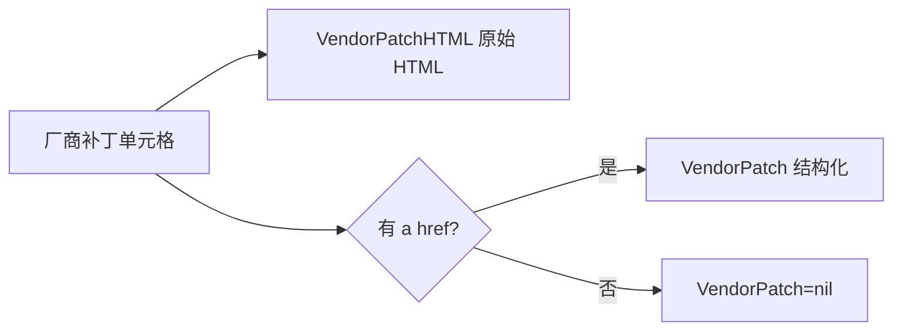

# 厂商补丁 VendorPatch

`VulDetail` 中厂商补丁由 `VendorPatchHTML`（原始 HTML）与 `VendorPatch`（结构化）双形态承载。

```go
VendorPatchHTML string
VendorPatch     *VendorPatch

type VendorPatch struct {
    Href  string
    Title string
}
```

## 字段表

| 字段 | 类型 | 说明 |
| --- | --- | --- |
| VendorPatchHTML | `string` | `厂商补丁` 单元格原始 HTML 片段 |
| VendorPatch.Href | `string` | 补丁详情页相对链接，如 `/patchInfo/show/289241` |
| VendorPatch.Title | `string` | 补丁标题文本 |

## 解析逻辑

`ParseVulDetail` 在 `case "厂商补丁"` 分支：

```go
patchHref, _ := valueSelection.Find("a").First().Attr("href")
patchTitle := valueSelection.Find("a").First().Text()
detail.VendorPatchHTML = valueHtml
if patchHref != "" {
    detail.VendorPatch = &VendorPatch{
        Href:  patchHref,
        Title: strings.TrimSpace(patchTitle),
    }
}
```

`VendorPatchHTML` 始终赋值，`VendorPatch` 仅在存在 `a[href]` 时填充。



## 用途

- `VendorPatch.Href` 可拼接为补丁详情页 URL，供 [`RequestVulPatchByURL`](../methods/request-vul-patch) 抓取。
- `VendorPatchHTML` 保留原始 HTML，便于自定义二次解析。

## 示例

```go
d, _ := x.FetchVulDetail(ctx, "CNVD-2021-67823", proxy)
if d.VendorPatch != nil {
    patchURL := "https://www.cnvd.org.cn" + d.VendorPatch.Href
    p, _ := x.RequestVulPatchByURL(ctx, patchURL, proxy)
    fmt.Println(p.Name, p.Link)
}
```

详见 [VendorPatch 字段](./vendor-patch-fields)。
