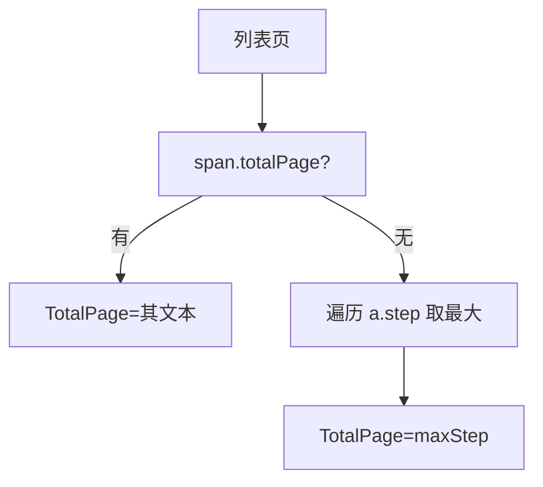

# VulList 字段

```go
type VulList struct {
    Page        *int
    TotalPage   *int
    TotalRecord *int
    VulListItems []*VulListItem
}
```

## 字段表

| 字段 | 类型 | 默认 | 来源节点 | 说明 |
| --- | --- | --- | --- | --- |
| Page | `*int` | `nil` | `span.currentStep` | 当前页码 |
| TotalPage | `*int` | `nil` | `span.totalPage` 或 `a.step` 最大值 | 总页数 |
| TotalRecord | `*int` | `nil` | `span.totalRecord` | 总记录数 |
| VulListItems | `[]*VulListItem` | `nil` | `a[href^='/flaw/show/CNVD-']` | 当前页条目 |

## 指针语义

`Page`/`TotalPage`/`TotalRecord` 为指针，零值 `nil` 表示页面无对应节点或解析失败。调用方需判空：

```go
if list.TotalPage != nil && page >= *list.TotalPage { ... }
```

## 解析逻辑

### Page

```go
pageNumStr := strings.TrimSpace(document.Find("span.currentStep").Text())
```

### TotalPage（双策略）

1. 优先取 `span.totalPage` 文本。
2. 若为空，遍历 `a.step`，取文本数字最大值（CNVD 真实列表页分页结构为 `span.currentStep` + `a.step`，最后一个 `a.step` 即总页数）。



### TotalRecord

仅当页面存在 `span.totalRecord` 时填充，部分页面无此节点。

### VulListItems

遍历所有 `a[href^='/flaw/show/CNVD-']`，取 `title` 与 `href` 属性。

## 示例

```go
list, _ := x.RequestVulListByOffset(ctx, 0, proxy)
if list.Page != nil {
    fmt.Println("当前页:", *list.Page)
}
if list.TotalRecord != nil {
    fmt.Println("总记录:", *list.TotalRecord)
}
```

详见 [VulListItem 字段](./vul-list-item-fields)。
