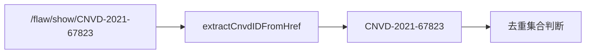
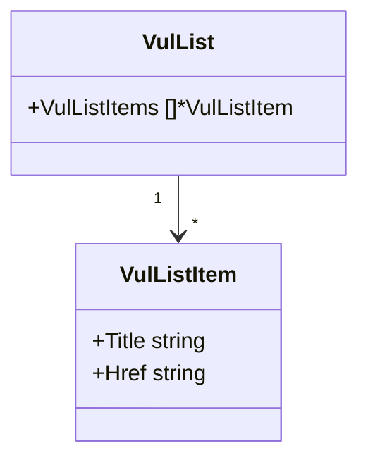

# VulListItem 字段

```go
type VulListItem struct {
    Title string
    Href  string
}
```

## 字段表

| 字段 | 类型 | 默认 | 来源属性 | 说明 |
| --- | --- | --- | --- | --- |
| Title | `string` | `""` | `title` | 漏洞标题（含完整描述） |
| Href | `string` | `""` | `href` | 详情页相对链接 |

## 来源 HTML

```html
<a href="/flaw/show/CNVD-2021-67823" title="Apache Log4j 远程代码执行漏洞">...</a>
```

`ParseVulList` 选择器 `a[href^='/flaw/show/CNVD-']`，取 `title` 与 `href` 属性，`TrimSpace` 处理空白。

## Href 用途

`Href` 为相对路径，拼接 `https://www.cnvd.org.cn` + `Href` 得到详情页 URL：

```go
detailURL := "https://www.cnvd.org.cn" + item.Href
detail, _ := x.RequestVulDetailByURL(ctx, detailURL, proxy)
```

`extractCnvdIDFromHref(item.Href)` 可从 Href 提取 CNVD-ID 用于去重：



## 关系



## 示例

```go
list, _ := x.RequestVulListByOffset(ctx, 0, proxy)
for _, it := range list.VulListItems {
    fmt.Println(it.Title, it.Href)
}
```
