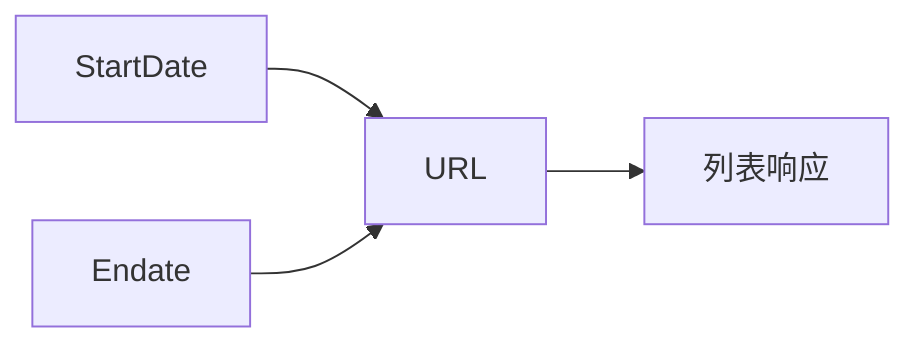

# StartDate / Endate 字段

```go
StartDate string
Endate    string
```

## 字段

| 字段 | 类型 | URL 参数 | 格式 |
| --- | --- | --- | --- |
| StartDate | `string` | `startDate` | `2006-01-02` |
| Endate | `string` | `endDate` | `2006-01-02` |

## Endate 命名说明

字段名 `Endate`（非 `EndDate`）：CNVD 表单字段为 `endDate`，Go 字段名避开与内置冲突，`buildQueryURL` 内部映射为 `endDate`：

```go
if q.Endate != "" {
    v.Set("endDate", q.Endate)
}
```

## buildQueryURL 拼装



仅非空字段拼入。零值（空串）不拼，按 CNVD 默认（无日期过滤）。

## 用途

按公开日期范围检索漏洞，配合 `VulListWithQuery` 翻页：

```go
q := cnvd_skills.VulListQuery{
    StartDate: "2024-01-01",
    Endate:    "2024-06-30",
}
err := x.VulListWithQuery(ctx, q, proxy, cfg)
```

## 示例

```go
q := cnvd_skills.VulListQuery{
    Keyword:   "Apache",
    StartDate: "2024-01-01",
    Endate:    "2024-06-30",
}
list, _ := x.RequestVulListByQuery(ctx, q, 0, proxy)
```

详见示例 [日期范围](../examples/date-range)。
