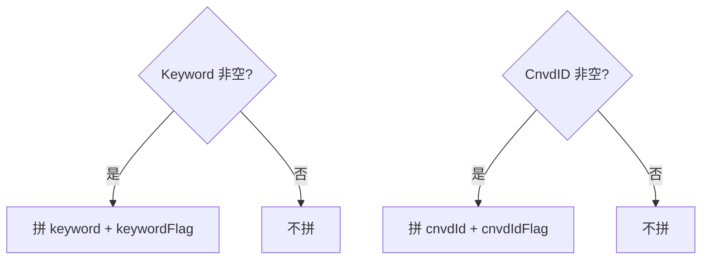

# KeywordFlag / CnvdIDFlag 字段

```go
KeywordFlag int
CnvdIDFlag int
```

## 字段

| 字段 | 类型 | URL 参数 | 取值 | 说明 |
| --- | --- | --- | --- | --- |
| KeywordFlag | `int` | `keywordFlag` | `0`=AND, `1`=OR | 关键词逻辑 |
| CnvdIDFlag | `int` | `cnvdIdFlag` | `0`=AND, `1`=OR | CNVD-ID 逻辑 |

## 拼装条件

仅当对应的 `Keyword` / `CnvdID` 非空时才拼入 flag：

```go
if q.Keyword != "" {
    v.Set("keyword", q.Keyword)
    v.Set("keywordFlag", fmt.Sprintf("%d", q.KeywordFlag))
}
if q.CnvdID != "" {
    v.Set("cnvdId", q.CnvdID)
    v.Set("cnvdIdFlag", fmt.Sprintf("%d", q.CnvdIDFlag))
}
```



## 默认 0 = AND

零值为 `0`，对应 CNVD 默认的 AND 逻辑。多关键词需 AND/OR 切换时显式设 `1`。

## 示例

```go
// 两个关键词 OR
q := cnvd_skills.VulListQuery{
    Keyword:     "Apache Log4j",
    KeywordFlag: 1, // OR
}
```
