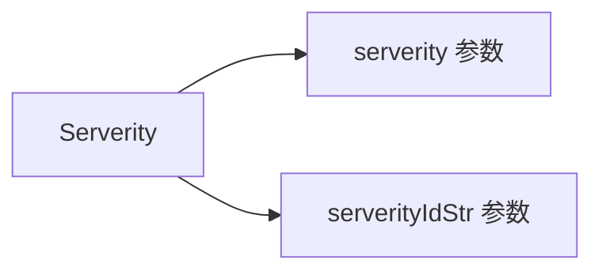

# CategoryId / ManufacturerId / Serverity 字段

```go
CategoryId     string
ManufacturerId string
Serverity      string
```

## 字段

| 字段 | 类型 | URL 参数 | 说明 |
| --- | --- | --- | --- |
| CategoryId | `string` | `categoryId` | 漏洞类别 ID（CNVD 内部编号） |
| ManufacturerId | `string` | `manufacturerId` | 厂商 ID（CNVD 内部编号） |
| Serverity | `string` | `serverity` + `serverityIdStr` | 危害级别 ID |

## Serverity 拼写说明

字段名 `Serverity`（非 `Severity`）：CNVD 表单字段原拼写即为 `serverity`（拼写错误），Go 字段名与之一致以保持映射直观。`buildQueryURL` 同时拼 `serverity` 与 `serverityIdStr`：

```go
if q.Serverity != "" {
    v.Set("serverity", q.Serverity)
    v.Set("serverityIdStr", q.Serverity)
}
```



## CategoryId / ManufacturerId 拼装

```go
if q.CategoryId != "" {
    v.Set("categoryId", q.CategoryId)
}
if q.ManufacturerId != "" {
    v.Set("manufacturerId", q.ManufacturerId)
}
```

非空才拼入。

## ID 获取

Category/Manufacturer/Severity 的内部 ID 需从 CNVD 列表页表单的下拉选项中获取，库不提供枚举常量。常见做法：用浏览器抓包查看列表页表单提交的参数值。

## 示例

```go
q := cnvd_skills.VulListQuery{
    ManufacturerId: "1234",
    Serverity:      "2", // 危害级别 ID，需查表
}
list, _ := x.RequestVulListByQuery(ctx, q, 0, proxy)
```
