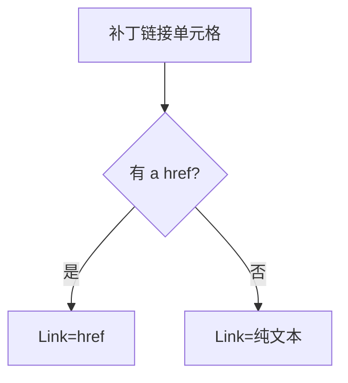

# VulPatch 字段

```go
type VulPatch struct {
    URL             string
    Name            string
    Vendor          string
    Link            string
    Description     string
    PublishTimeStr  string
    PublishTime     *time.Time
}
```

## 字段表

| 字段 | 类型 | 默认 | 来源 key | 说明 |
| --- | --- | --- | --- | --- |
| URL | `string` | `""` | 调用方传入 | 补丁详情页 URL |
| Name | `string` | `""` | `补丁名称` | 补丁名称 |
| Vendor | `string` | `""` | `补丁厂商` | 补丁厂商 |
| Link | `string` | `""` | `补丁链接` `a href` 或文本 | 补丁下载/参考链接 |
| Description | `string` | `""` | `补丁描述` | 补丁描述 |
| PublishTimeStr | `string` | `""` | `补丁发布时间` | 发布时间字符串 |
| PublishTime | `*time.Time` | `nil` | 解析自 `补丁发布时间` | 发布时间 |

## Link 解析

```go
case "补丁链接":
    href, exists := valueSelection.Find("a").First().Attr("href")
    if exists {
        patch.Link = href
    } else {
        patch.Link = valueText
    }
```

优先取 `a[href]`，无则退化为纯文本。



## PublishTime 解析

复用 `parseCnvdDate`，支持 4 种 layout，全部失败为 `nil`，调用方用 `PublishTimeStr` 兜底。详见 [时间字段](./vul-detail-times)。

## URL 回填

`RequestVulPatchByURLWithConfig` 在解析后 `patch.URL = patchPageURL`，与 `VulDetail.URL` 同模式。

## 示例

```go
p, _ := x.RequestVulPatchByID(ctx, "289241", proxy)
fmt.Println(p.Name, p.Vendor, p.Link)
```
