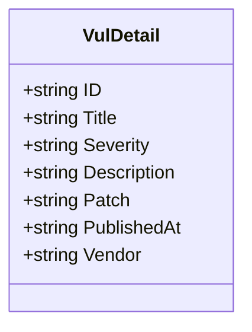

# VulDetail 类型

本页说明漏洞详情结构 VulDetail 的字段构成。

## 类型字段

VulDetail 承载单条漏洞的完整描述信息。

```mermaid
classDiagram
    class VulDetail {
        +string ID
        +string Title
        +string Severity
        +string Description
        +string Patch
        +string PublishedAt
        +string Vendor
    }
```

> 本页内容将在后续任务填充。
