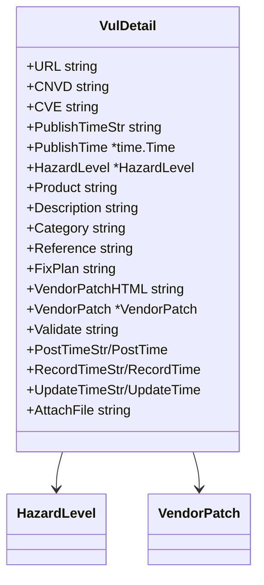

# VulDetail 类型

`VulDetail` 表示 CNVD 单条漏洞详情，由 [`ParseVulDetail`](./methods/parse-vul-detail) 从详情页 HTML `.gg_detail tr` 解析得到。

## 类型定义

```go
package cnvd_skills

import "time"

type VulDetail struct {
    URL             string
    CNVD            string
    CVE             string
    PublishTimeStr  string
    PublishTime     *time.Time
    HazardLevel     *HazardLevel
    Product         string
    Description     string
    Category        string
    Reference      string
    FixPlan         string
    VendorPatchHTML string
    VendorPatch     *VendorPatch
    Validate        string
    PostTimeStr    string
    PostTime        *time.Time
    RecordTimeStr  string
    RecordTime      *time.Time
    UpdateTimeStr  string
    UpdateTime      *time.Time
    AttachFile     string
}
```

## 字段表（21 项）

| 字段 | 类型 | 来源 key | 详解 |
| --- | --- | --- | --- |
| URL | `string` | 调用方传入 | [URL 与 CNVD](./types/vul-detail-url-cnvd) |
| CNVD | `string` | `CNVD-ID` | [URL 与 CNVD](./types/vul-detail-url-cnvd) |
| CVE | `string` | `CVE ID` | [CVE 字段](./types/vul-detail-cve) |
| PublishTimeStr / PublishTime | `string` / `*time.Time` | `公开日期` | [时间字段](./types/vul-detail-times) |
| HazardLevel | `*HazardLevel` | `危害级别` | [HazardLevel](./types/vul-detail-hazard-level) |
| Product | `string` | `影响产品` | [其他字段](./types/vul-detail-others) |
| Description | `string` | `漏洞描述` | [其他字段](./types/vul-detail-others) |
| Category | `string` | `漏洞类型` | [其他字段](./types/vul-detail-others) |
| Reference | `string` | `参考链接` | [其他字段](./types/vul-detail-others) |
| FixPlan | `string` | `漏洞解决方案` | [其他字段](./types/vul-detail-others) |
| VendorPatchHTML / VendorPatch | `string` / `*VendorPatch` | `厂商补丁` | [厂商补丁](./types/vul-detail-vendor-patch) |
| Validate | `string` | `验证信息` | [其他字段](./types/vul-detail-others) |
| PostTimeStr / PostTime | `string` / `*time.Time` | `报送时间` | [时间字段](./types/vul-detail-times) |
| RecordTimeStr / RecordTime | `string` / `*time.Time` | `收录时间` | [时间字段](./types/vul-detail-times) |
| UpdateTimeStr / UpdateTime | `string` / `*time.Time` | `更新时间` | [时间字段](./types/vul-detail-times) |
| AttachFile | `string` | `漏洞附件` | [其他字段](./types/vul-detail-others) |

## 嵌套类型

### HazardLevel

```go
type HazardLevel struct {
    Level  string
    CVSS2 string
}
```

详见 [HazardLevel 字段](./types/hazard-level-fields) 与 [危害级别详解](./types/vul-detail-hazard-level)。

### VendorPatch

```go
type VendorPatch struct {
    Href  string
    Title string
}
```

详见 [VendorPatch 字段](./types/vendor-patch-fields) 与 [厂商补丁详解](./types/vul-detail-vendor-patch)。

## 字段关系



## 示例

```go
x := cnvd_skills.NewCnvdSkills()
d, err := x.FetchVulDetail(context.Background(), "CNVD-2021-67823", cnvd_skills.FixedProxyProvider(""))
if err != nil { return }
fmt.Println(d.CNVD, d.CVE, d.Product)
if d.HazardLevel != nil {
    fmt.Println(d.HazardLevel.Level, d.HazardLevel.CVSS2)
}
```
