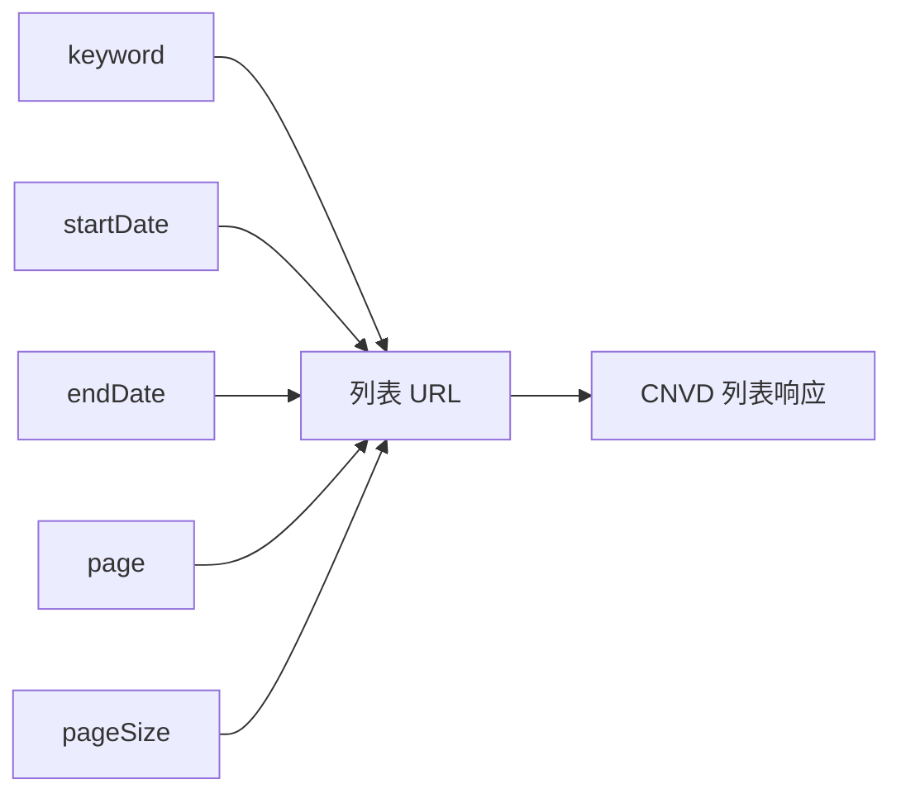

# VulListQuery 类型

本页说明列表检索参数类型 VulListQuery 的字段与 URL 拼装关系。

## 字段到 URL 的映射

各查询字段被拼装到 CNVD 列表请求的查询参数中。

```mermaid
flowchart LR
    K[keyword] --> U[列表 URL]
    S[startDate] --> U
    E[endDate] --> U
    P[page] --> U
    Z[pageSize] --> U
    U --> R[CNVD 列表响应]
```

> 本页内容将在后续任务填充。
