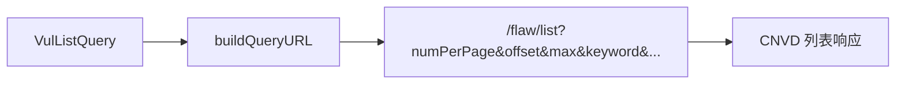

# VulListQuery 类型

`VulListQuery` 封装 CNVD 列表页的检索条件，字段名对应 CNVD 真实列表页表单字段。零值字段不拼入查询。

## 类型定义

```go
package cnvd_skills

type VulListQuery struct {
    Keyword        string
    KeywordFlag    int
    StartDate      string
    Endate         string
    CnvdID         string
    CnvdIDFlag     int
    CategoryId     string
    ManufacturerId string
    Serverity      string
    ReferenceScope int
    Order          string
    NumPerPage     int
}
```

## 字段表（12 项）

| 字段 | 类型 | URL 参数 | 详解 |
| --- | --- | --- | --- |
| Keyword | `string` | `keyword` | [字段逐项](./types/vul-list-query-fields) |
| KeywordFlag | `int` | `keywordFlag` | [标志位](./types/vul-list-query-flags) |
| StartDate | `string` | `startDate` | [日期](./types/vul-list-query-date) |
| Endate | `string` | `endDate` | [日期](./types/vul-list-query-date) |
| CnvdID | `string` | `cnvdId` | [字段逐项](./types/vul-list-query-fields) |
| CnvdIDFlag | `int` | `cnvdIdFlag` | [标志位](./types/vul-list-query-flags) |
| CategoryId | `string` | `categoryId` | [ID 类](./types/vul-list-query-ids) |
| ManufacturerId | `string` | `manufacturerId` | [ID 类](./types/vul-list-query-ids) |
| Serverity | `string` | `serverity` + `serverityIdStr` | [ID 类](./types/vul-list-query-ids) |
| ReferenceScope | `int` | `referenceScope` | [字段逐项](./types/vul-list-query-fields) |
| Order | `string` | `order` | [字段逐项](./types/vul-list-query-fields) |
| NumPerPage | `int` | `numPerPage` + `max` | [字段逐项](./types/vul-list-query-fields) |

## 命名说明

- **Endate**（非 EndDate）：CNVD 表单字段为 `endDate`，Go 字段名避开与内置冲突，`buildQueryURL` 内部映射为 `endDate`。
- **Serverity**（非 Severity）：CNVD 表单字段原拼写即为 `serverity`（拼写错误），Go 字段名与之一致以保持映射直观。

## buildQueryURL 映射

```go
func (q *VulListQuery) buildQueryURL(offset int) string
```

构造 `https://www.cnvd.org.cn/flaw/list?<query>`，`offset` 从 0 起，非空字段拼入：



## 示例

```go
q := cnvd_skills.VulListQuery{
    Keyword:   "Apache",
    StartDate: "2024-01-01",
    Endate:    "2024-06-30",
}
x := cnvd_skills.NewCnvdSkills()
list, err := x.RequestVulListByQuery(context.Background(), q, 0, cnvd_skills.FixedProxyProvider(""))
```
