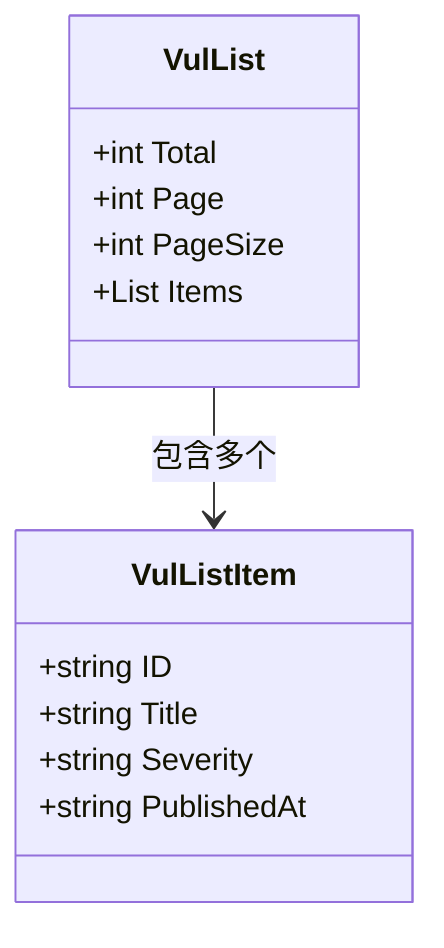

# VulList 类型

本页说明列表结果类型 VulList 与 VulListItem 的结构。

## 类型关系

VulList 是列表容器，VulListItem 是其中单条摘要。

```mermaid
classDiagram
    class VulList {
        +int Total
        +int Page
        +int PageSize
        +List Items
    }
    class VulListItem {
        +string ID
        +string Title
        +string Severity
        +string PublishedAt
    }
    VulList --> VulListItem : 包含多个
```

> 本页内容将在后续任务填充。
