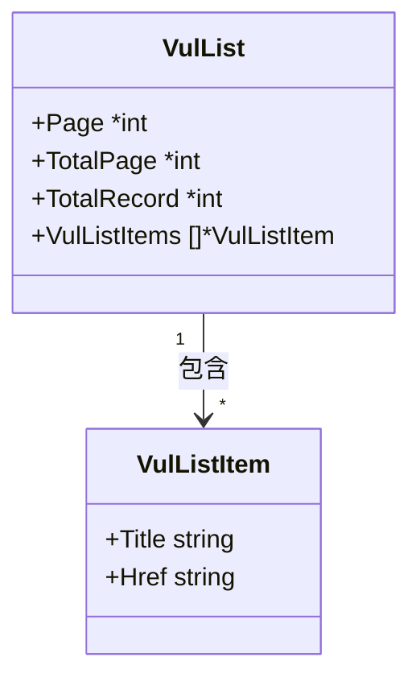

# VulList 类型

`VulList` 是 CNVD 列表页解析结果容器，`VulListItem` 是其中单条漏洞摘要。

## 类型定义

```go
package cnvd_skills

type VulList struct {
    Page        *int
    TotalPage   *int
    TotalRecord *int
    VulListItems []*VulListItem
}

type VulListItem struct {
    Title string
    Href  string
}
```

`Page`/`TotalPage`/`TotalRecord` 为指针，零值表示页面无对应节点（无法解析时为 `nil`）。

## 字段表

### VulList

| 字段 | 类型 | 来源节点 | 详解 |
| --- | --- | --- | --- |
| Page | `*int` | `span.currentStep` | [VulList 字段](./types/vul-list-fields) |
| TotalPage | `*int` | `span.totalPage` 或 `a.step` 最大值 | [VulList 字段](./types/vul-list-fields) |
| TotalRecord | `*int` | `span.totalRecord` | [VulList 字段](./types/vul-list-fields) |
| VulListItems | `[]*VulListItem` | `a[href^='/flaw/show/CNVD-']` | [VulListItem](./types/vul-list-item-fields) |

### VulListItem

| 字段 | 类型 | 来源属性 | 详解 |
| --- | --- | --- | --- |
| Title | `string` | `title` | [VulListItem 字段](./types/vul-list-item-fields) |
| Href | `string` | `href`（相对路径） | [VulListItem 字段](./types/vul-list-item-fields) |

## 字段关系



## 示例

```go
x := cnvd_skills.NewCnvdSkills()
list, err := x.RequestVulListByOffset(context.Background(), 0, cnvd_skills.FixedProxyProvider(""))
if err != nil { return }
fmt.Printf("page=%v total=%v items=%d\n", list.Page, list.TotalPage, len(list.VulListItems))
for _, it := range list.VulListItems {
    fmt.Println(it.Title, it.Href)
}
```
