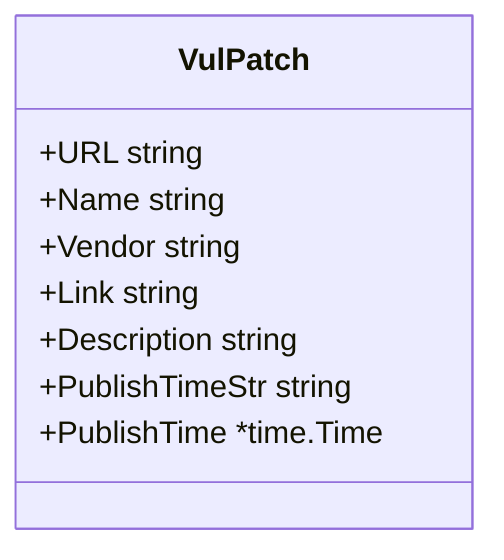

# VulPatch 类型

`VulPatch` 是厂商补丁详情，由 [`ParseVulPatch`](./methods/parse-vul-patch) 从补丁详情页 HTML `.gg_detail tr` 解析得到。

## 类型定义

```go
package cnvd_skills

import "time"

type VulPatch struct {
    URL             string
    Name            string
    Vendor          string
    Link            string
    Description     string
    PublishTimeStr  string
    PublishTime     *time.Time
}
```

## 字段表（7 项）

| 字段 | 类型 | 来源 key | 详解 |
| --- | --- | --- | --- |
| URL | `string` | 调用方传入 | [VulPatch 字段](./types/vul-patch-fields) |
| Name | `string` | `补丁名称` | [VulPatch 字段](./types/vul-patch-fields) |
| Vendor | `string` | `补丁厂商` | [VulPatch 字段](./types/vul-patch-fields) |
| Link | `string` | `补丁链接`（`a href` 或文本） | [VulPatch 字段](./types/vul-patch-fields) |
| Description | `string` | `补丁描述` | [VulPatch 字段](./types/vul-patch-fields) |
| PublishTimeStr / PublishTime | `string` / `*time.Time` | `补丁发布时间` | [VulPatch 字段](./types/vul-patch-fields) |

`PublishTime` 由 `parseCnvdDate` 解析，全部 layout 失败时为 `nil`，调用方用 `PublishTimeStr` 兜底。

## 字段关系



## 示例

```go
x := cnvd_skills.NewCnvdSkills()
patch, err := x.RequestVulPatchByID(context.Background(), "289241", cnvd_skills.FixedProxyProvider(""))
if err != nil { return }
fmt.Println(patch.Name, patch.Vendor, patch.Link)
```
