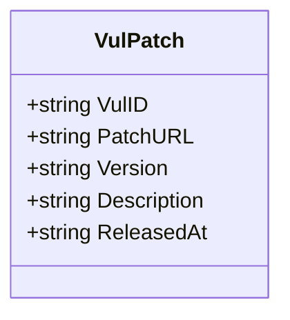

# VulPatch 类型

本页说明厂商补丁信息类型 VulPatch 的字段构成。

## 类型字段

VulPatch 承载漏洞关联的厂商补丁地址、版本与说明。

```mermaid
classDiagram
    class VulPatch {
        +string VulID
        +string PatchURL
        +string Version
        +string Description
        +string ReleasedAt
    }
```

> 本页内容将在后续任务填充。
