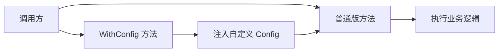

# WithConfig 对照表

本页说明每个业务方法对应的 WithConfig 变体及其委托关系。

## 普通版与 WithConfig 的委托

普通版使用默认 Config，WithConfig 版接受外部传入的 Config 后委托普通版执行。

```mermaid
flowchart LR
    C[调用方] --> N[普通版方法]
    C --> W[WithConfig 方法]
    W --> D[注入自定义 Config]
    D --> N
    N --> R[执行业务逻辑]
```

> 本页内容将在后续任务填充。
