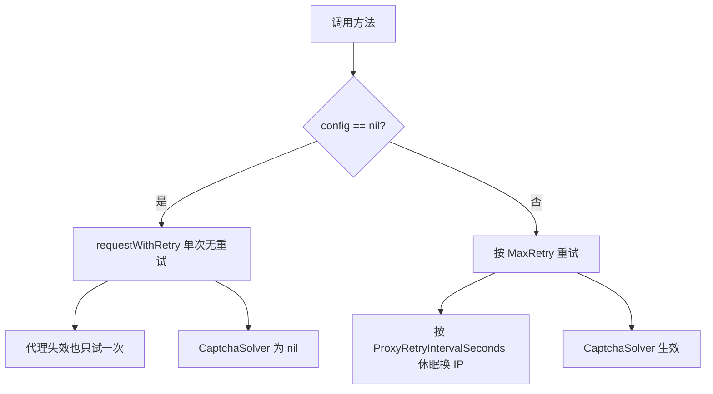

# WithConfig 对照表

cnvd_skills 提供 7 对普通版 / `WithConfig` 版方法。普通版等价于 `WithConfig(..., nil)`，`config=nil` 时退化为不重试的单次请求。

## 对照表

| 普通版 | WithConfig 版 | 详解 |
| --- | --- | --- |
| `RequestVulDetailByID` | `RequestVulDetailByIDWithConfig` | [RequestVulDetail](./methods/request-vul-detail) |
| `RequestVulDetailByURL` | `RequestVulDetailByURLWithConfig` | [RequestVulDetail](./methods/request-vul-detail) |
| `FetchVulDetail` | `FetchVulDetailWithConfig` | [FetchVulDetail](./methods/fetch-vul-detail) |
| `RequestVulListByOffset` | `RequestVulListByOffsetWithConfig` | [RequestVulListByOffset](./methods/request-vul-list-offset) |
| `RequestVulListByQuery` | `RequestVulListByQueryWithConfig` | [RequestVulListByQuery](./methods/request-vul-list-query) |
| `RequestVulPatchByID` | `RequestVulPatchByIDWithConfig` | [RequestVulPatch](./methods/request-vul-patch) |
| `RequestVulPatchByURL` | `RequestVulPatchByURLWithConfig` | [RequestVulPatch](./methods/request-vul-patch) |

## 委托关系

普通版不重复实现，统一委托 WithConfig 版并传 `nil`：

```go
func (x *CnvdSkills) RequestVulDetailByURL(ctx context.Context, detailPageURL string, proxyProvider ProxyProvider) (*VulDetail, error) {
    return x.RequestVulDetailByURLWithConfig(ctx, detailPageURL, proxyProvider, nil)
}
```

`VulList` / `VulListWithQuery` 主流程方法本身即接收 `config *Config`（无成对变体），`config==nil` 内部回退到 [`DefaultConfig`](./methods/default-config)。

## config=nil 的行为差异



`MaxRetry=0`、`RequestTimeoutSeconds=0`、`CaptchaSolver=nil` 时，带 config 版与 `config=nil` 行为基本一致，仅差超时与验证码识别能力。

## 选择建议

- 一次性脚本、本地测试：用普通版（`FetchVulDetail` / `RequestVulListByOffset`）。
- 生产抓取、需过验证码、需重试：用 WithConfig 版并配 `jsl.CaptchaSolver`。
- 翻页落盘主流程：用 `VulList` / `VulListWithQuery`（自带 config）。

## 示例

```go
x := cnvd_skills.NewCnvdSkills()
proxy := cnvd_skills.FixedProxyProvider("")

// 普通版：单次请求
d1, _ := x.RequestVulDetailByID(ctx, "CNVD-2021-67823", proxy)

// WithConfig 版：带重试与验证码识别器
cfg := cnvd_skills.DefaultConfig()
cfg.CaptchaSolver = mySolver
d2, _ := x.RequestVulDetailByIDWithConfig(ctx, "CNVD-2021-67823", proxy, cfg)
```
