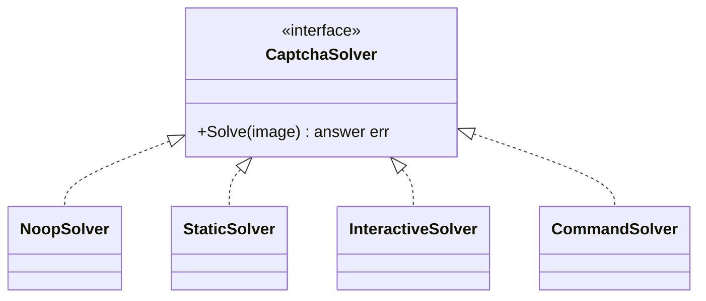

# CaptchaSolver 接口

本页说明 CaptchaSolver 接口契约及其四个内置实现。

## 接口与实现

CaptchaSolver 定义识别协议，四个实现覆盖不同使用场景。

```mermaid
classDiagram
    class CaptchaSolver {
        <<interface>>
        +Solve(image) answer err
    }
    class NoopSolver
    class StaticSolver
    class InteractiveSolver
    class CommandSolver
    CaptchaSolver <|.. NoopSolver
    CaptchaSolver <|.. StaticSolver
    CaptchaSolver <|.. InteractiveSolver
    CaptchaSolver <|.. CommandSolver
```

> 本页内容将在后续任务填充。
