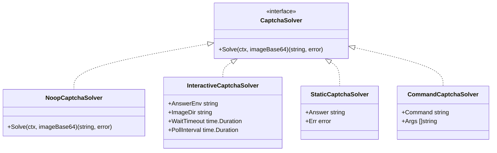
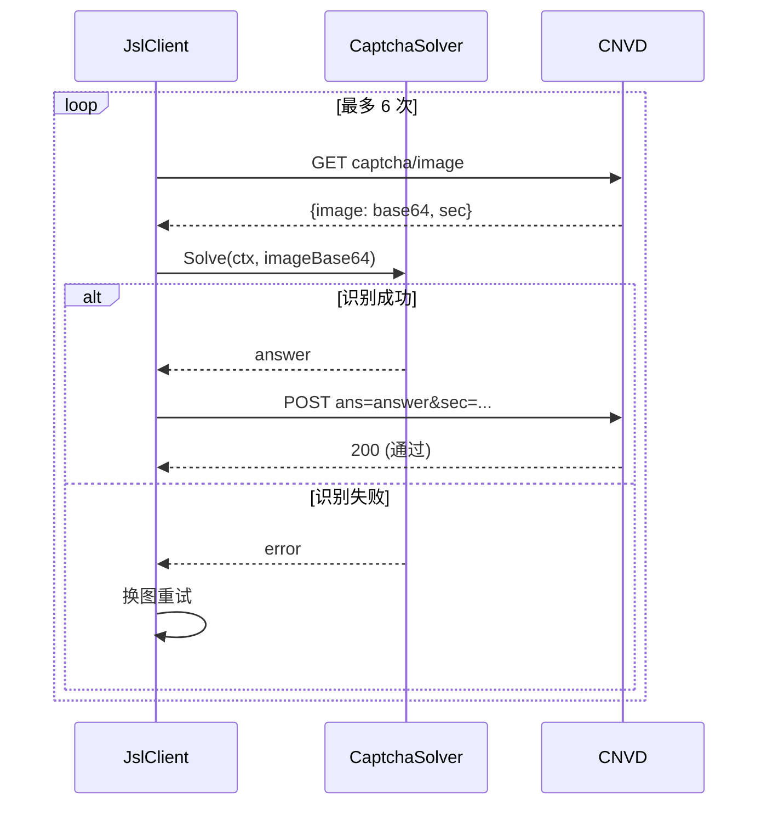

# CaptchaSolver 接口

`CaptchaSolver` 把"验证码图片→答案字符串"这一步抽象成接口，库内自动完成取图、提交、放行刷新，仅把识别留给实现。返回 error 表示无法识别，库会换一张图重试（最多 6 次）。

源码位置：[`gojsl/captcha.go`](https://github.com/scagogogo/cnvd-skills/blob/main/gojsl/captcha.go)。

## 接口定义

```go
type CaptchaSolver interface {
    Solve(ctx context.Context, imageBase64 string) (string, error)
}
```

`Solve` 接收 base64 编码的 PNG 图片数据（与 CNVD captcha 端点返回的 `image` 字段同格式），返回识别出的答案字符串。`ctx` 用于取消。

## 内置实现

| 实现 | 用途 | 详见 |
|------|------|------|
| `NoopCaptchaSolver` | 永不识别，遇验证码即上抛 `ErrCaptchaRequired` | [Noop](/api-gojsl/types/noop-captcha-solver) |
| `InteractiveCaptchaSolver` | 写图到磁盘，轮询环境变量等人工/外部脚本填答案 | [Interactive](/api-gojsl/types/interactive-captcha-solver) |
| `StaticCaptchaSolver` | 返回固定答案，仅供单测 | [Static](/api-gojsl/types/static-captcha-solver) |
| `CommandCaptchaSolver` | 调外部命令（如 ddddocr）识别 | [Command](/api-gojsl/types/command-captcha-solver) |

实现对比详见 [Solver 实现详解](/api-gojsl/solver-implementations)。

## 接口与实现关系



## 调用流程

`JslClient.processCaptcha` 在每轮重试中调用 `Solve`，失败换图重试。



## 自定义实现

只需实现 `Solve` 方法即可接入任意识别后端：

```go
package main

import (
    "context"

    "github.com/scagogogo/go-jsl"
)

type MySolver struct{}

func (MySolver) Solve(ctx context.Context, imageBase64 string) (string, error) {
    // 调用你的 OCR / 打码平台
    return "答案", nil
}

func main() {
    client := jsl.NewJslClient("", 30, MySolver{})
    _, _ = client.Get(context.Background(), "https://www.cnvd.org.cn/")
}
```

详见 [示例 - 自定义 Solver](/api-gojsl/examples/custom-solver)。
