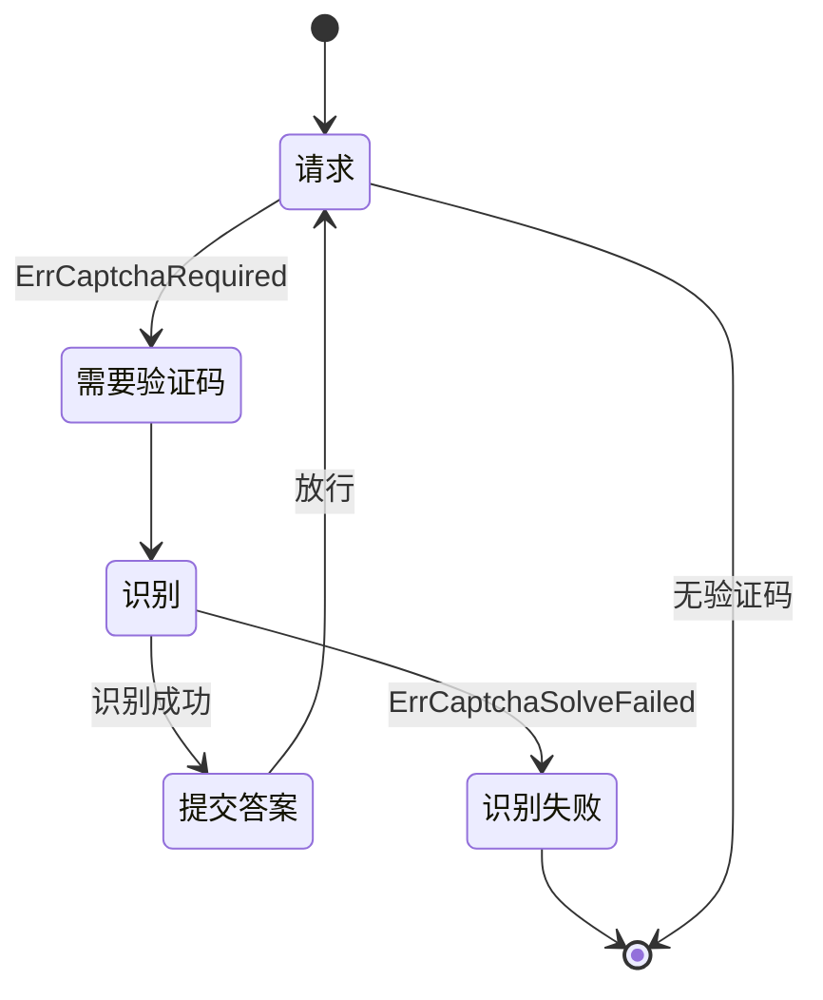

# 错误变量

本页说明 go-jsl 暴露的验证码相关错误变量及其流转。

## 错误流转

ErrCaptchaRequired 触发识别流程，ErrCaptchaSolveFailed 表示识别失败。

```mermaid
stateDiagram-v2
    [*] --> 请求
    请求 --> 需要验证码: ErrCaptchaRequired
    需要验证码 --> 识别
    识别 --> 提交答案: 识别成功
    识别 --> 识别失败: ErrCaptchaSolveFailed
    提交答案 --> 请求: 放行
    识别失败 --> [*]
    请求 --> [*]: 无验证码
```

> 本页内容将在后续任务填充。
