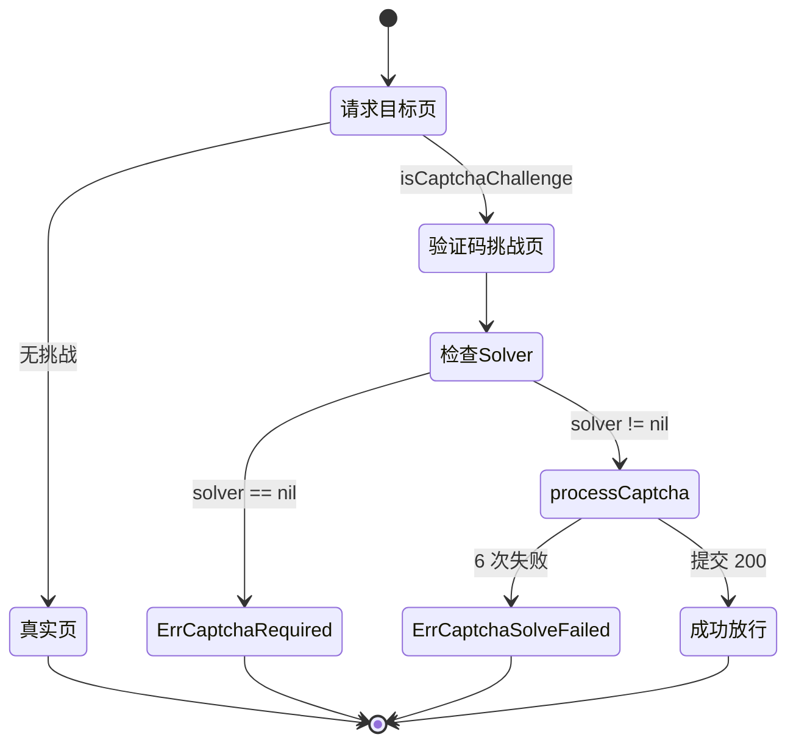

# 错误变量

go-jsl 暴露两个验证码相关错误变量，调用方可用 `errors.Is` 精确判断。源码位置：[`gojsl/captcha.go`](https://github.com/scagogogo/cnvd-skills/blob/main/gojsl/captcha.go)。

## 错误定义

```go
var (
    ErrCaptchaRequired  = errors.New("captcha challenge required but no solver configured")
    ErrCaptchaSolveFailed = errors.New("captcha solve failed after retries")
)
```

| 错误 | 字面量 | 触发条件 | 详见 |
|------|--------|----------|------|
| `ErrCaptchaRequired` | `captcha challenge required but no solver configured` | 响应为验证码挑战页，但 `solver` 为 nil | [ErrCaptchaRequired 详解](/api-gojsl/types/err-captcha-required) |
| `ErrCaptchaSolveFailed` | `captcha solve failed after retries` | 配置了 solver 但 6 次重试均失败 | [ErrCaptchaSolveFailed 详解](/api-gojsl/types/err-captcha-solve-failed) |

## 错误流转



## errors.Is 用法

```go
package main

import (
    "context"
    "errors"
    "fmt"

    "github.com/scagogogo/go-jsl"
)

func main() {
    client := jsl.NewJslClient("", 30, nil) // 不配识别器
    _, err := client.Get(context.Background(), "https://www.cnvd.org.cn/")

    switch {
    case errors.Is(err, jsl.ErrCaptchaRequired):
        fmt.Println("需配置识别器，见 /faq/captcha-required-error")
    case errors.Is(err, jsl.ErrCaptchaSolveFailed):
        fmt.Println("识别失败，见 /faq/captcha-solve-failed")
    case err != nil:
        fmt.Println("其他错误:", err)
    }
}
```

> 注：`ErrCaptchaSolveFailed` 也作为 `InteractiveCaptchaSolver` 等待超时的 wrap 根因（`fmt.Errorf("%w: ...", ErrCaptchaSolveFailed, ...)`），`errors.Is` 仍可命中。

## 相关错误

非验证码错误（如网络错误、创宇盾拦截、goja 求值失败）以普通 `error` 形式返回，字面量见源码注释。详见 [示例 - 错误处理](/api-gojsl/examples/error-handling)。
