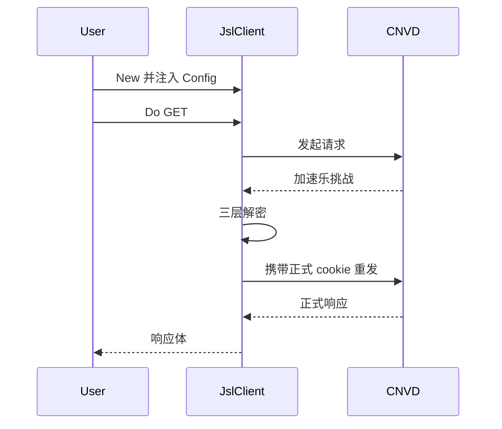

# 独立使用 JslClient 示例

本页演示脱离 CnvdSkills，单独使用 go-jsl 的 JslClient 进行 GET 请求。

## 调用时序

初始化 JslClient 后直接发起请求，加速乐挑战由内部自动处理。

```mermaid
sequenceDiagram
    participant User
    participant JslClient
    participant CNVD
    User->>JslClient: New 并注入 Config
    User->>JslClient: Do GET
    JslClient->>CNVD: 发起请求
    CNVD-->>JslClient: 加速乐挑战
    JslClient->>JslClient: 三层解密
    JslClient->>CNVD: 携带正式 cookie 重发
    CNVD-->>JslClient: 正式响应
    JslClient-->>User: 响应体
```

> 本页内容将在后续任务填充。
