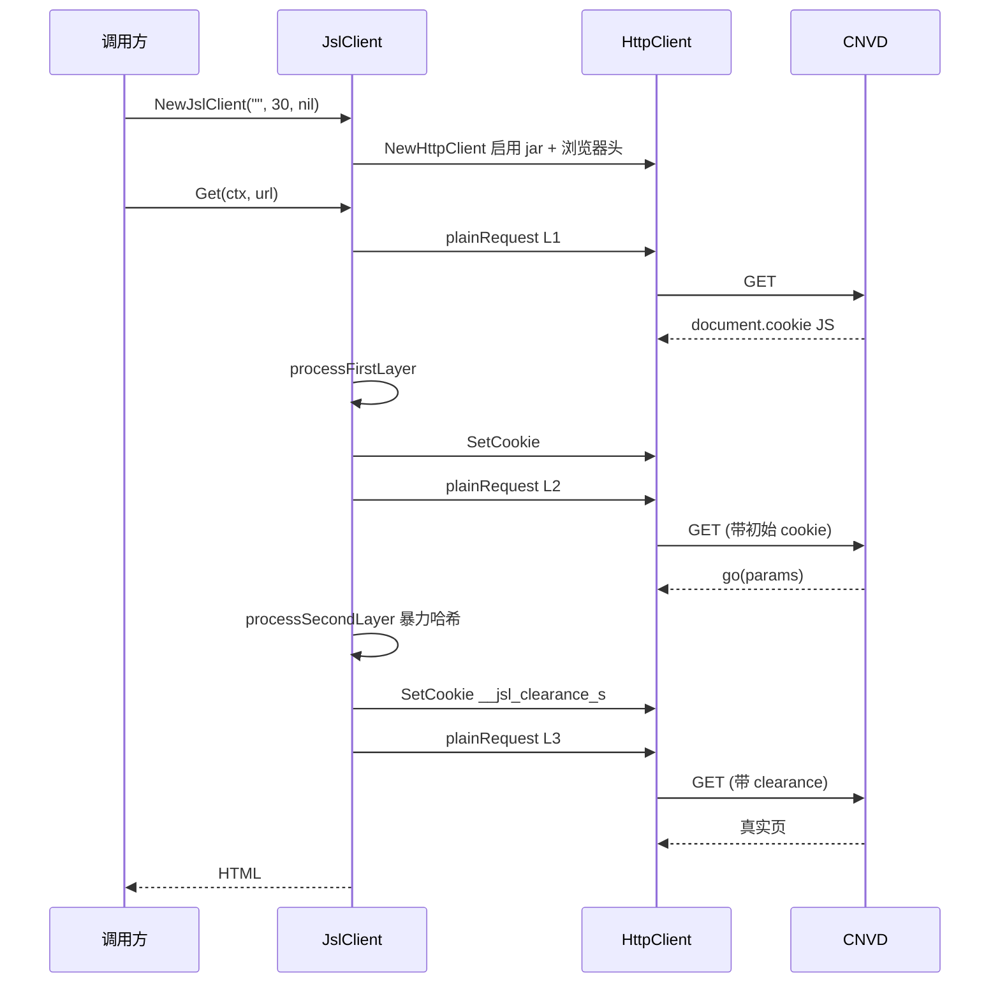

# 基础 GET 示例

脱离 cnvd-skills，独立 `go get` 使用 go-jsl 的 `JslClient` 直接发起 GET，加速乐三层解密与验证码挑战由内部自动处理。

## 安装

```bash
go get github.com/scagogogo/go-jsl
```

## 调用时序



## 完整示例

```go
package main

import (
    "context"
    "fmt"
    "log"

    "github.com/scagogogo/go-jsl"
)

func main() {
    // proxy 空串直连；30 秒超时；不配 solver（遇验证码返回 ErrCaptchaRequired）
    client := jsl.NewJslClient("", 30, nil)
    log.Printf("proxy=%q hasSolver=%v", client.Proxy(), client.HasSolver())

    html, err := client.Get(context.Background(), "https://www.cnvd.org.cn/flaw/show/CNVD-2021-67823")
    if err != nil {
        log.Fatalf("get failed: %v", err)
    }
    fmt.Printf("html length: %d\n", len(html))
    fmt.Printf("first 200 chars: %s\n", html[:min(200, len(html))])
}

func min(a, b int) int {
    if a < b {
        return a
    }
    return b
}
```

## 配置识别器版

若目标 URL 会触发验证码挑战，需配 `CaptchaSolver`：

```go
client := jsl.NewJslClient("", 60, jsl.CommandCaptchaSolver{
    Command: "python3",
    Args:    []string{"scripts/ddddocr_solver.py"},
})
html, err := client.Get(ctx, "https://www.cnvd.org.cn/")
```

详见 [示例 - 验证码全自动](/api-gojsl/examples/captcha-auto)。

## 相关

- [JslClient 类型](/api-gojsl/jsl-client)
- [Get 方法](/api-gojsl/methods/get)
- [独立使用示例](/api-gojsl/examples/standalone-use)
- [错误处理示例](/api-gojsl/examples/error-handling)
