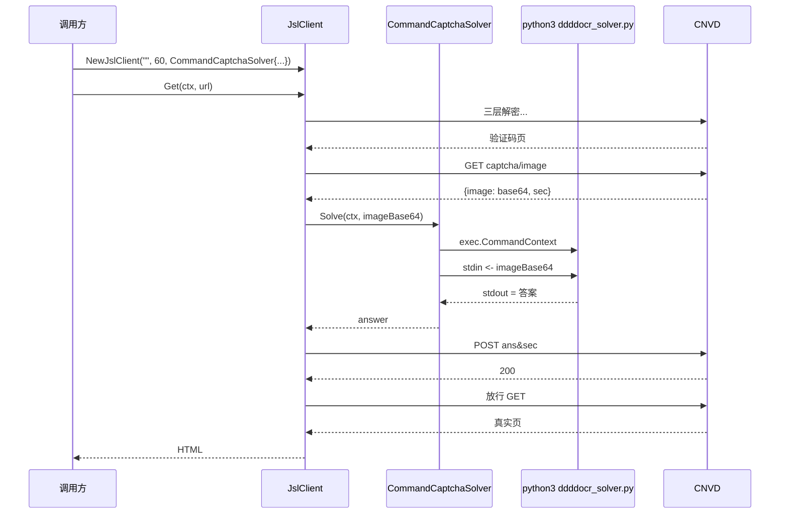

# 验证码全自动示例

`CommandCaptchaSolver` 配合 `scripts/ddddocr_solver.py`（ddddocr）实现中文词组验证码全自动识别。

## 前置

安装 ddddocr（见 [FAQ - ddddocr 安装](/faq/ddddocr-install)）：

```bash
pip install ddddocr
```

确认 `scripts/ddddocr_solver.py` 存在（仓库自带，从 stdin 读 base64 → ddddocr 识别 → stdout 输出答案）。

## 调用链



## 完整示例

```go
package main

import (
    "context"
    "log"

    "github.com/scagogogo/go-jsl"
)

func main() {
    client := jsl.NewJslClient("", 60, jsl.CommandCaptchaSolver{
        Command: "python3",
        Args:    []string{"scripts/ddddocr_solver.py"},
    })
    if !client.HasSolver() {
        log.Fatal("solver not configured")
    }

    html, err := client.Get(context.Background(), "https://www.cnvd.org.cn/flaw/show/CNVD-2021-67823")
    if err != nil {
        log.Fatalf("get failed: %v", err)
    }
    log.Printf("html length: %d", len(html))
}
```

## 调试技巧

- 若识别失败频繁，确认 `python3 -c "import ddddocr"` 成功。
- ddddocr 对中文词组识别有概率性，`processCaptcha` 最多重试 6 次通常足够（见 [processCaptcha 内部](/api-gojsl/methods/process-captcha-internals)）。
- `CommandCaptchaSolver` 失败时错误信息含子进程 stderr，便于定位。

## 相关

- [CommandCaptchaSolver](/api-gojsl/types/command-captcha-solver)
- [FAQ - ddddocr 安装](/faq/ddddocr-install)
- [FAQ - 识别失败排查](/faq/captcha-solve-failed)
- [基础 GET 示例](/api-gojsl/examples/basic-get)
