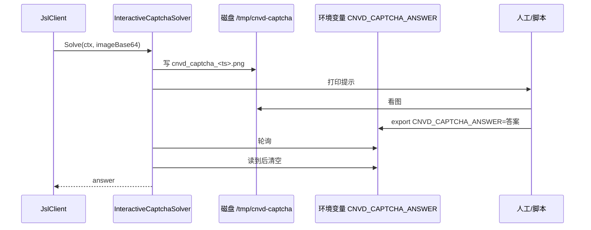

# 验证码交互示例

`InteractiveCaptchaSolver` 把验证码图写到磁盘临时文件，轮询环境变量等待人工或外部脚本填入答案。适合交互/调试场景。

## 工作方式



## 完整示例

```go
package main

import (
    "context"
    "log"
    "time"

    "github.com/scagogogo/go-jsl"
)

func main() {
    solver := jsl.InteractiveCaptchaSolver{
        AnswerEnv:    "CNVD_CAPTCHA_ANSWER",
        ImageDir:     "/tmp/cnvd-captcha",
        WaitTimeout:  10 * time.Minute,
        PollInterval: 2 * time.Second,
    }
    client := jsl.NewJslClient("", 120, solver)

    go func() {
        // 在另一个终端/脚本里看图后:
        //   export CNVD_CAPTCHA_ANSWER="加速乐"
    }()

    html, err := client.Get(context.Background(), "https://www.cnvd.org.cn/")
    if err != nil {
        log.Fatalf("get failed: %v", err)
    }
    log.Printf("html length: %d", len(html))
}
```

## 配合外部识别脚本

`ImageDir` 下的 png 可被外部脚本（如调打码平台 API）处理后写回环境变量：

```bash
# 终端 A: 跑 Go 程序
# 终端 B: 看到 /tmp/cnvd-captcha/cnvd_captcha_*.png 后
export CNVD_CAPTCHA_ANSWER="识别结果"
```

## 字段说明

| 字段 | 默认 | 语义 |
|------|------|------|
| `AnswerEnv` | `CNVD_CAPTCHA_ANSWER` | 答案环境变量名 |
| `ImageDir` | `os.TempDir()` | 图保存目录 |
| `WaitTimeout` | `5 * time.Minute` | 等待最长时间 |
| `PollInterval` | `1 * time.Second` | 轮询间隔 |

详见 [InteractiveCaptchaSolver](/api-gojsl/types/interactive-captcha-solver)。

## 相关

- [InteractiveCaptchaSolver](/api-gojsl/types/interactive-captcha-solver)
- [CommandCaptchaSolver 全自动](/api-gojsl/examples/captcha-auto)
- [自定义 Solver 示例](/api-gojsl/examples/custom-solver)
