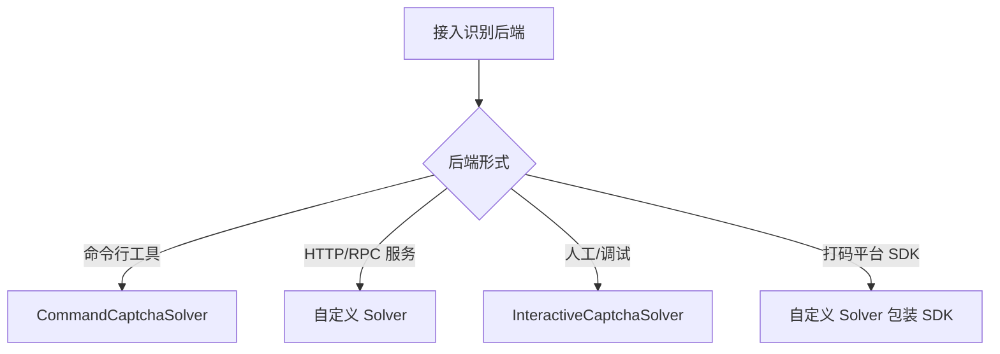

# 自定义 Solver 示例

实现 `CaptchaSolver` 接口接入任意识别后端（打码平台、自建 OCR 服务等）。

## 接口契约

只需实现一个方法：

```go
type CaptchaSolver interface {
    Solve(ctx context.Context, imageBase64 string) (string, error)
}
```

返回 error 库会换图重试（最多 6 次）；答案字符串应去首尾空白。

## 示例：HTTP OCR 服务

```go
package main

import (
    "context"
    "encoding/json"
    "io"
    "net/http"
    "strings"

    "github.com/scagogogo/go-jsl"
)

// MySolver 调用自建 OCR HTTP 服务
type MySolver struct {
    Endpoint string // 如 "http://127.0.0.1:5000/ocr"
}

type ocrResp struct {
    Answer string `json:"answer"`
}

func (s MySolver) Solve(ctx context.Context, imageBase64 string) (string, error) {
    req, err := http.NewRequestWithContext(ctx, http.MethodPost, s.Endpoint, strings.NewReader(imageBase64))
    if err != nil {
        return "", err
    }
    req.Header.Set("Content-Type", "text/plain")
    resp, err := http.DefaultClient.Do(req)
    if err != nil {
        return "", err
    }
    defer resp.Body.Close()
    var r ocrResp
    if err := json.NewDecoder(io.LimitReader(resp.Body, 1<<20)).Decode(&r); err != nil {
        return "", err
    }
    return strings.TrimSpace(r.Answer), nil
}

func main() {
    client := jsl.NewJslClient("", 60, MySolver{Endpoint: "http://127.0.0.1:5000/ocr"})
    _, _ = client.Get(context.Background(), "https://www.cnvd.org.cn/")
}
```

## 识别器选择决策



## 包装打码平台

打码平台通常提供图片上传→答案查询 API，包装成 `CaptchaSolver`：

```go
type CodePlatformSolver struct {
    APIKey string
    Client *http.Client
}

func (s CodePlatformSolver) Solve(ctx context.Context, imageBase64 string) (string, error) {
    // 1. 上传 base64 图片到平台
    // 2. 轮询/阻塞拿答案
    // 3. 返回答案
    return callPlatform(ctx, s.APIKey, imageBase64)
}
```

## 相关

- [CaptchaSolver 接口](/api-gojsl/types/captcha-solver-interface)
- [Solve 方法](/api-gojsl/methods/solve)
- [验证码全自动示例](/api-gojsl/examples/captcha-auto)
