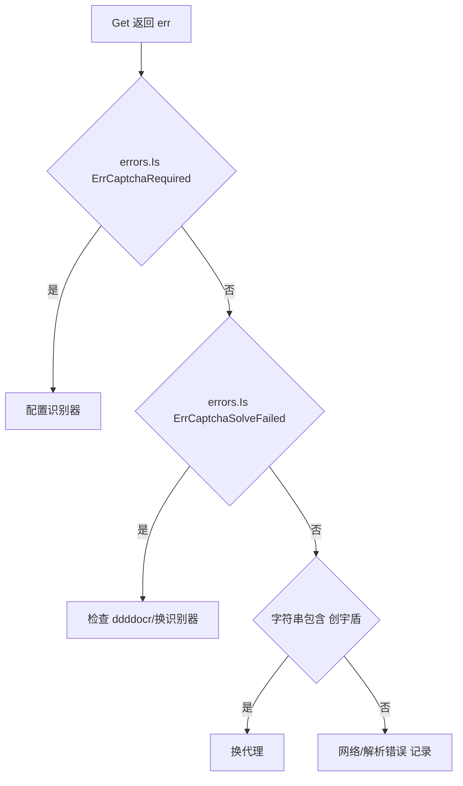

# 错误处理示例

用 `errors.Is` 精确区分 go-jsl 的错误类型，并处理非验证码错误。

## 错误分类



## 完整示例

```go
package main

import (
    "context"
    "errors"
    "fmt"
    "log"
    "strings"

    "github.com/scagogogo/go-jsl"
)

func fetch(url string) error {
    client := jsl.NewJslClient("", 60, nil)
    _, err := client.Get(context.Background(), url)
    if err == nil {
        return nil
    }

    switch {
    case errors.Is(err, jsl.ErrCaptchaRequired):
        return fmt.Errorf("需配置识别器: %w", err)
    case errors.Is(err, jsl.ErrCaptchaSolveFailed):
        return fmt.Errorf("识别失败: %w", err)
    case strings.Contains(err.Error(), "创宇盾"):
        return fmt.Errorf("代理可能被封: %w", err)
    default:
        return fmt.Errorf("其他错误: %w", err)
    }
}

func main() {
    if err := fetch("https://www.cnvd.org.cn/"); err != nil {
        log.Fatal(err)
    }
    fmt.Println("ok")
}
```

## 常见非验证码错误

| 错误信息片段 | 来源 | 处理 |
|--------------|------|------|
| `blocked by 创宇盾` | `plainRequest.isBlockedByShield` | 换代理，见 [FAQ - 代理被封](/faq/proxy-banned) |
| `can not parse first layer cookie` | `processFirstLayer` | 加速乐改版，见 [FAQ - CNVD 改版](/faq/cnvd-changed) |
| `can not find go(params)` | `processSecondLayer` | 同上 |
| `goja eval first layer cookie failed` | `processFirstLayer` | JS 求值异常，记录响应体排查 |
| `parse captcha image failed` | `fetchCaptchaImage` | 验证码端点异常，重试 |
| `captcha endpoint returned %d` | `captchaRequest` | 端点非 200，重试 |

## 重试包装

对可重试错误可在调用方加退避重试：

```go
func fetchWithRetry(url string, max int) (string, error) {
    for i := 0; i < max; i++ {
        c := jsl.NewJslClient("", 60, solver)
        html, err := c.Get(context.Background(), url)
        if err == nil {
            return html, nil
        }
        if errors.Is(err, jsl.ErrCaptchaRequired) {
            return "", err // 不可重试，直接返回
        }
        time.Sleep(time.Duration(i+1) * time.Second)
    }
    return "", fmt.Errorf("max retries exceeded")
}
```

## 相关

- [错误变量](/api-gojsl/errors)
- [ErrCaptchaRequired 详解](/api-gojsl/types/err-captcha-required)
- [ErrCaptchaSolveFailed 详解](/api-gojsl/types/err-captcha-solve-failed)
- [FAQ - 遇 ErrCaptchaRequired 怎么办](/faq/captcha-required-error)
