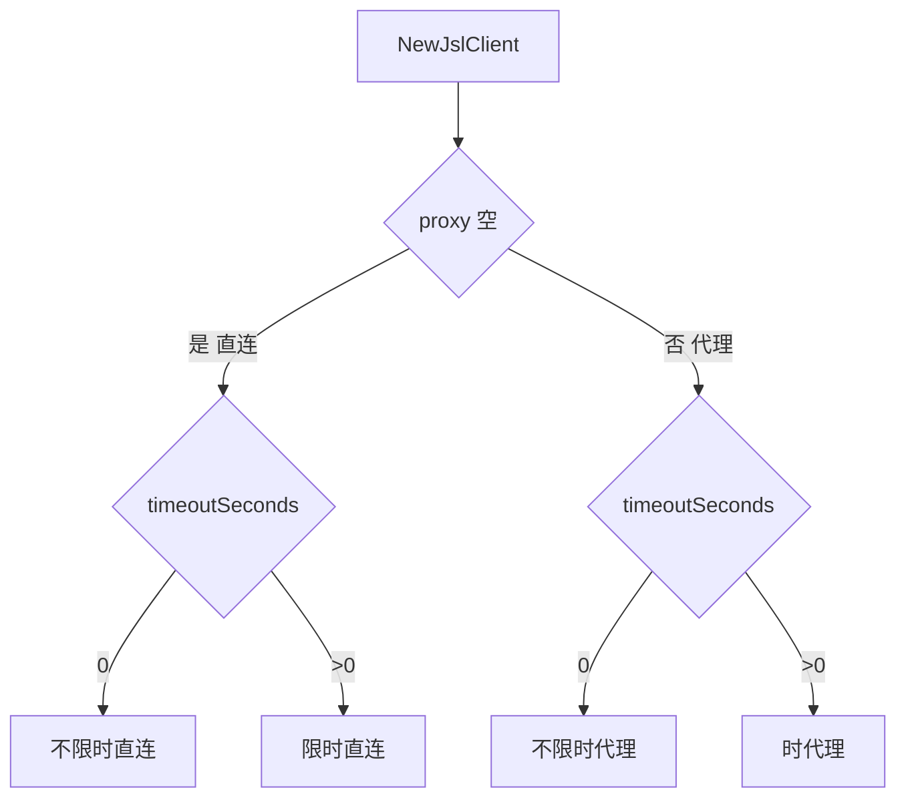

# 代理与超时配置示例

`NewJslClient` 与 `NewHttpClient` 均支持代理与超时。本页演示常见配置。

## 构造参数

| 参数 | 空值/0 含义 |
|------|-------------|
| `proxy` | 空串 = 直连 |
| `timeoutSeconds` | 0 = 不限时 |
| `solver` | nil = 遇验证码返回 `ErrCaptchaRequired` |

## 配置组合



## HTTP 代理示例

```go
package main

import (
    "context"
    "log"

    "github.com/scagogogo/go-jsl"
)

func main() {
    client := jsl.NewJslClient("http://127.0.0.1:7890", 60, nil)
    log.Printf("proxy=%s", client.Proxy())

    html, err := client.Get(context.Background(), "https://www.cnvd.org.cn/")
    if err != nil {
        log.Fatal(err)
    }
    log.Printf("html length: %d", len(html))
}
```

## SOCKS5 代理示例

resty 支持 SOCKS5（底层 Go net/http）：

```go
client := jsl.NewJslClient("socks5://127.0.0.1:1080", 60, nil)
```

## 代理轮换（每请求独立实例）

```go
package main

import (
    "context"
    "log"

    "github.com/scagogogo/go-jsl"
)

func fetchWithProxy(proxy, url string) (string, error) {
    c := jsl.NewJslClient(proxy, 30, nil)
    return c.Get(context.Background(), url)
}

func main() {
    proxies := []string{"http://1.2.3.4:8080", "http://5.6.7.8:8080"}
    for _, p := range proxies {
        html, err := fetchWithProxy(p, "https://www.cnvd.org.cn/")
        log.Printf("proxy=%s err=%v len=%d", p, err, len(html))
    }
}
```

## 超时与 context

超时也可通过 `context.WithTimeout` 控制，比构造时的固定超时更灵活：

```go
ctx, cancel := context.WithTimeout(context.Background(), 15*time.Second)
defer cancel()
html, err := client.Get(ctx, url)
```

## 创宇盾拦截

若代理被封，`plainRequest` 会返回 `blocked by 创宇盾 (proxy may be banned)`。排查见 [FAQ - 代理被封](/faq/proxy-banned)。

## 相关

- [NewJslClient](/api-gojsl/methods/new-jsl-client)
- [NewHttpClient](/api-gojsl/methods/new-http-client)
- [Proxy 方法](/api-gojsl/methods/proxy)
- [FAQ - 代理被封](/faq/proxy-banned)
