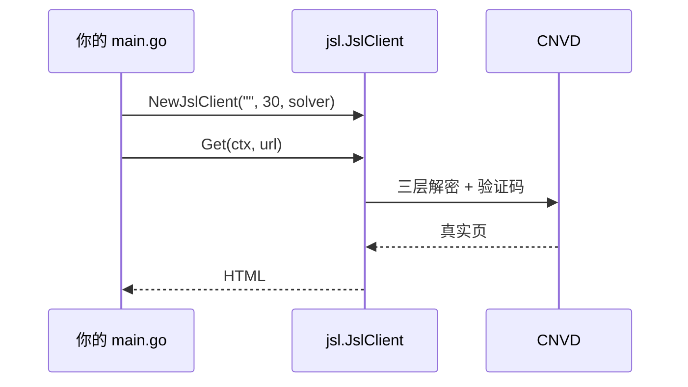

# 独立使用示例

脱离 cnvd-skills，把 `github.com/scagogogo/go-jsl` 作为独立依赖 `go get` 使用。

## 安装

```bash
go get github.com/scagogogo/go-jsl
```

## 最小项目结构

```
myapp/
├── go.mod
├── main.go
└── scripts/
    └── ddddocr_solver.py   # 仅 CommandCaptchaSolver 需要
```

`go.mod`：

```
module myapp

go 1.18

require github.com/scagogogo/go-jsl vX.Y.Z
```

## 调用时序



## 完整示例

```go
package main

import (
    "context"
    "errors"
    "fmt"
    "log"

    "github.com/scagogogo/go-jsl"
)

func main() {
    client := jsl.NewJslClient("", 60, jsl.CommandCaptchaSolver{
        Command: "python3",
        Args:    []string{"scripts/ddddocr_solver.py"},
    })

    html, err := client.Get(context.Background(), "https://www.cnvd.org.cn/flaw/show/CNVD-2021-67823")
    if err != nil {
        switch {
        case errors.Is(err, jsl.ErrCaptchaRequired):
            log.Fatal("需配置识别器")
        case errors.Is(err, jsl.ErrCaptchaSolveFailed):
            log.Fatal("识别失败，检查 ddddocr")
        default:
            log.Fatalf("get failed: %v", err)
        }
    }
    fmt.Printf("html length: %d\n", len(html))
}
```

## 不依赖 cnvd-skills

go-jsl 仅依赖 goja（JS 引擎）与 go-resty（HTTP），无私有依赖。可直接被任意 Go 项目引用，无需引入 cnvd-skills CLI 或其配置。详见 [FAQ - monorepo replace](/faq/monorepo-replace)。

## 单独使用 HttpClient

若只需浏览器级 HTTP 客户端（不要三层解密），可单独用 `HttpClient`：

```go
hc := jsl.NewHttpClient("", 30)
body, _ := hc.Do(context.Background(), "https://example.com/", nil)
```

详见 [HttpClient 类型](/api-gojsl/http-client)。

## 相关

- [基础 GET 示例](/api-gojsl/examples/basic-get)
- [NewJslClient](/api-gojsl/methods/new-jsl-client)
- [FAQ - monorepo replace](/faq/monorepo-replace)
- [README](https://github.com/scagogogo/cnvd-skills/blob/main/gojsl/README.md)
