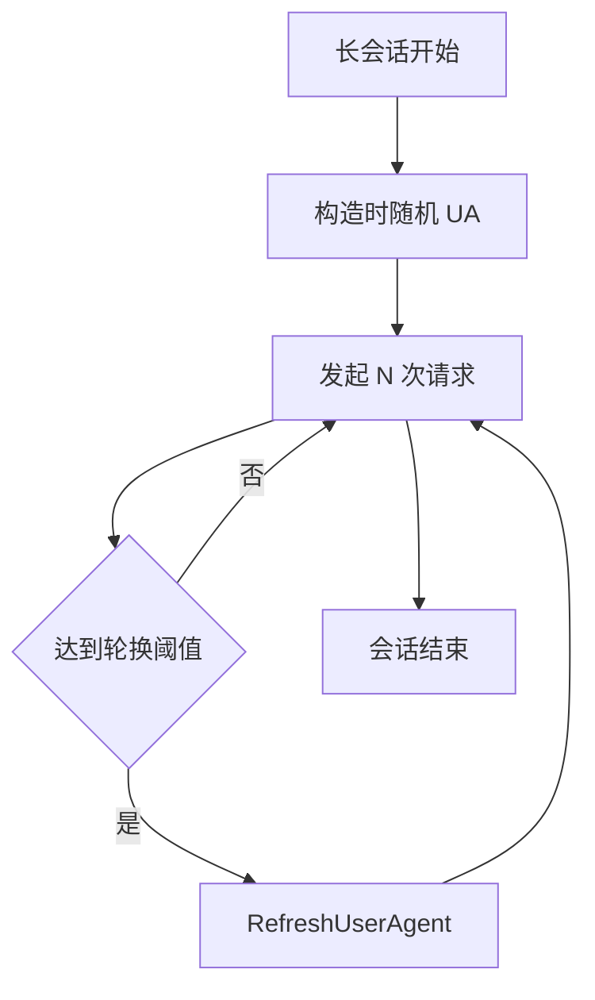

# UA 轮换示例

长会话定期调 `RefreshUserAgent` 轮换 UA，降低指纹固定风险。

## UA 池

go-jsl 内置 4 个真实 Chrome UA（121/122 × Win/Mac/Linux），见 [UA 池内部](/api-gojsl/types/ua-pool-internals)。构造时随机选一个，`RefreshUserAgent` 重新随机选并重设浏览器级 Header（Client Hints 与 UA 联动）。

## 轮换策略



## 示例：翻页时轮换

```go
package main

import (
    "context"
    "log"
    "time"

    "github.com/scagogogo/go-jsl"
)

func main() {
    hc := jsl.NewHttpClient("", 30)
    for i := 1; i <= 50; i++ {
        if i%10 == 0 {
            hc.RefreshUserAgent()
            log.Printf("round %d: refreshed UA", i)
        }
        body, err := hc.Do(context.Background(), "https://www.cnvd.org.cn/flaw/list?num=1", nil)
        if err != nil {
            log.Printf("round %d err: %v", i, err)
            continue
        }
        log.Printf("round %d body length: %d", i, len(body))
        time.Sleep(2 * time.Second)
    }
}
```

## 与 JslClient 配合

`JslClient` 内部持有一个 `HttpClient`，可通过 `client` 字段间接访问（未导出）。若需轮换，建议直接用 `HttpClient` 或在每次 `Get` 间隙通过暴露的 `HttpClient` 操作。`RefreshUserAgent` 是 `HttpClient` 的方法，对 `JslClient` 用户需自行扩展访问。

## 注意

- 轮换是随机的，可能选到与当前相同 UA（4 选 1，概率 1/4）。
- `RefreshUserAgent` 加锁，建议在请求间隙调用，不要与正在飞的请求并发重设 Header。
- TLS 指纹未随 UA 变化（未用 uTLS），见 [TLS 指纹范围](/api-gojsl/types/tls-fingerprint-scope)。

## 相关

- [RefreshUserAgent 方法](/api-gojsl/methods/refresh-user-agent)
- [UA 池内部](/api-gojsl/types/ua-pool-internals)
- [userAgent 内部](/api-gojsl/types/user-agent-internals)
