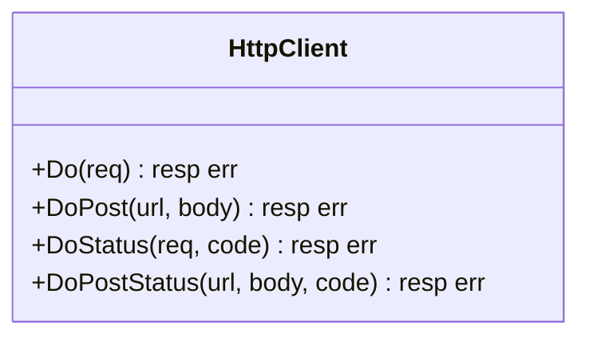

# HttpClient

本页说明 go-jsl 的 HttpClient 类型及其核心方法。

## 方法构成

HttpClient 提供通用与带状态码断言的 GET/POST 入口。

```mermaid
classDiagram
    class HttpClient {
        +Do(req) resp err
        +DoPost(url, body) resp err
        +DoStatus(req, code) resp err
        +DoPostStatus(url, body, code) resp err
    }
```

> 本页内容将在后续任务填充。
