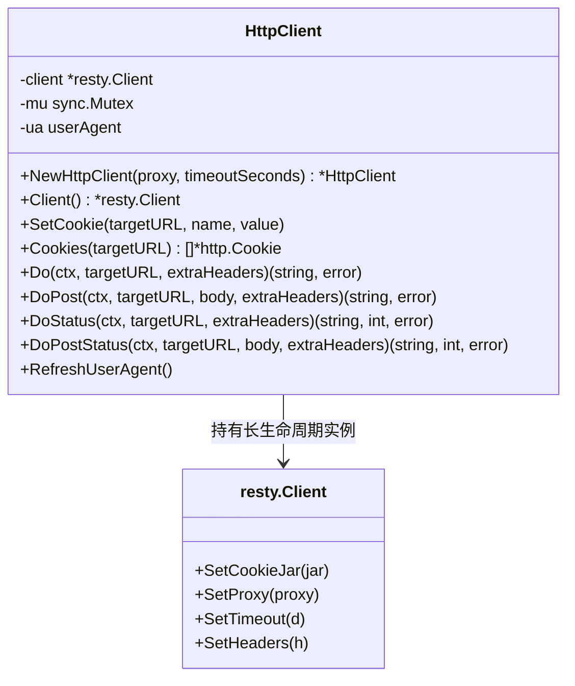
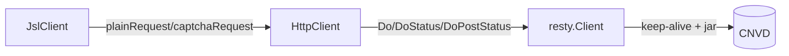

# HttpClient

`HttpClient` 是 go-jsl 包内部统一收发 HTTP 请求的客户端，持有一个长生命周期的 `*resty.Client`，复用 TCP/TLS 连接、启用 cookie jar 自动管理会话、配置浏览器级 Header。可独立于 `JslClient` 使用。

源码位置：[`gojsl/httpclient.go`](https://github.com/scagogogo/cnvd-skills/blob/main/gojsl/httpclient.go)。

## 类型定义

```go
type HttpClient struct {
    client *resty.Client
    mu     sync.Mutex
    ua     userAgent
}
```

字段均未导出。`client` 是底层 resty 客户端，`mu` 保护 `ua` 轮换，`ua` 是当前选中的 UA（含 Client Hints 联动）。字段语义详见 [类型详解 - HttpClient 结构](/api-gojsl/types/http-client-struct)。

## 方法签名

| 方法 | 签名 | 说明 |
|------|------|------|
| `NewHttpClient` | `func NewHttpClient(proxy string, timeoutSeconds int) *HttpClient` | 构造，启用 cookie jar + 浏览器级 Header |
| `Client` | `func (h *HttpClient) Client() *resty.Client` | 返回底层 resty client |
| `SetCookie` | `func (h *HttpClient) SetCookie(targetURL, name, value string)` | 往 jar 写入一个 cookie |
| `Cookies` | `func (h *HttpClient) Cookies(targetURL string) []*http.Cookie` | 返回 jar 中某 URL 的所有 cookie |
| `Do` | `func (h *HttpClient) Do(ctx context.Context, targetURL string, extraHeaders map[string]string) (string, error)` | GET 返回响应体 |
| `DoPost` | `func (h *HttpClient) DoPost(ctx context.Context, targetURL, body string, extraHeaders map[string]string) (string, error)` | POST `application/x-www-form-urlencoded` 返回响应体 |
| `DoStatus` | `func (h *HttpClient) DoStatus(ctx context.Context, targetURL string, extraHeaders map[string]string) (string, int, error)` | GET 返回响应体与状态码 |
| `DoPostStatus` | `func (h *HttpClient) DoPostStatus(ctx context.Context, targetURL, body string, extraHeaders map[string]string) (string, int, error)` | POST 返回响应体与状态码 |
| `RefreshUserAgent` | `func (h *HttpClient) RefreshUserAgent()` | 轮换到另一个 UA |

## 类图



## 与 JslClient 的关系

`JslClient` 内部持有一个 `HttpClient`，三层解密每一跳与验证码流程都经它收发，降低被反爬识别的概率。



## 示例

```go
package main

import (
    "context"
    "fmt"

    "github.com/scagogogo/go-jsl"
)

func main() {
    hc := jsl.NewHttpClient("", 30)
    defer hc.RefreshUserAgent()

    body, err := hc.Do(context.Background(), "https://www.cnvd.org.cn/", nil)
    if err != nil {
        panic(err)
    }
    fmt.Println("body length:", len(body))
}
```

Header 策略与 UA 池见 [Header 策略](/api-gojsl/types/headers-strategy) 与 [UA 池内部](/api-gojsl/types/ua-pool-internals)。
