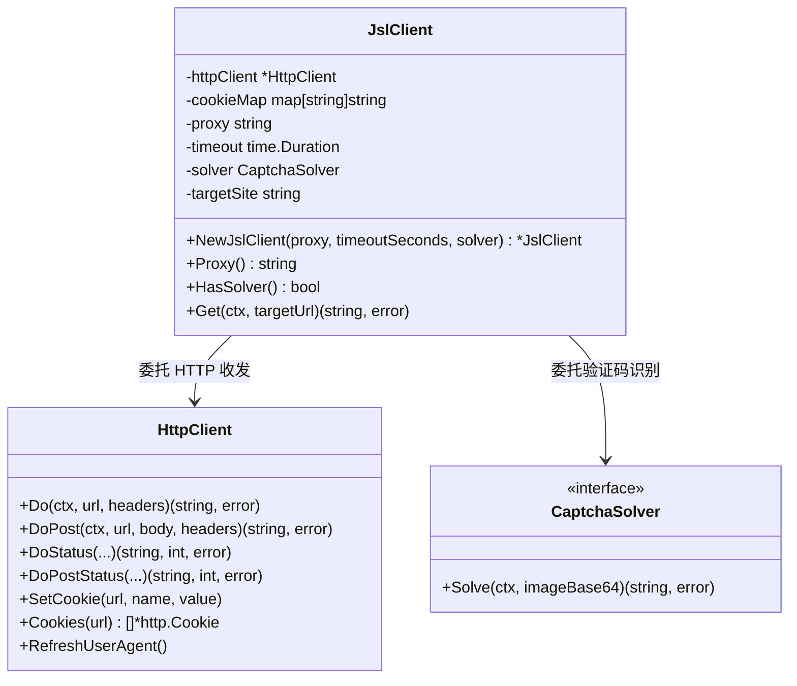

# JslClient

`JslClient` 是 go-jsl 包（package `jsl`）的核心类型，破解加速乐（JSL）三层加密并在第三层返回验证码挑战页时自动取图→识别→提交→放行刷新拿真实页。可独立于 cnvd-skills 使用。

源码位置：[`gojsl/client.go`](https://github.com/scagogogo/cnvd-skills/blob/main/gojsl/client.go)。

## 类型定义

```go
type JslClient struct {
    httpClient  *HttpClient
    cookieMap   map[string]string
    proxy       string
    timeout     time.Duration
    solver      CaptchaSolver
    targetSite  string
}
```

所有字段均未导出，外部仅能通过 `NewJslClient` 构造、通过方法访问。字段语义详见 [类型详解 - JslClient 结构](/api-gojsl/types/jsl-client-struct)。

## 方法签名

| 方法 | 签名 | 说明 |
|------|------|------|
| `NewJslClient` | `func NewJslClient(proxy string, timeoutSeconds int, solver CaptchaSolver) *JslClient` | 构造，proxy 空串直连，timeoutSeconds 为 0 不限时，solver 为 nil 遇验证码返回 ErrCaptchaRequired |
| `Proxy` | `func (x *JslClient) Proxy() string` | 返回配置的代理地址（只读） |
| `HasSolver` | `func (x *JslClient) HasSolver() bool` | 返回是否配置了识别器 |
| `Get` | `func (x *JslClient) Get(ctx context.Context, targetUrl string) (string, error)` | 三层解密 + 验证码全流程，返回最终页 HTML |

## 类关系

`JslClient` 内部组合 `HttpClient`（统一收发）与 `CaptchaSolver`（识别器），三层解密每一跳与验证码流程都经 `HttpClient` 收发。



## 并发安全

一个实例非并发安全（cookie jar 会随请求累积）。并发场景请为每个请求构造独立实例，详见 [FAQ - 并发安全](/faq/concurrent-safe)。

## 示例

```go
package main

import (
    "context"
    "fmt"

    "github.com/scagogogo/go-jsl"
)

func main() {
    client := jsl.NewJslClient("", 30, nil)
    fmt.Println("proxy:", client.Proxy(), "has solver:", client.HasSolver())

    html, err := client.Get(context.Background(), "https://www.cnvd.org.cn/flaw/show/CNVD-2021-67823")
    if err != nil {
        panic(err)
    }
    fmt.Println("html length:", len(html))
}
```

更多示例见 [示例 - 基础 GET](/api-gojsl/examples/basic-get) 与 [示例 - 独立使用](/api-gojsl/examples/standalone-use)。
