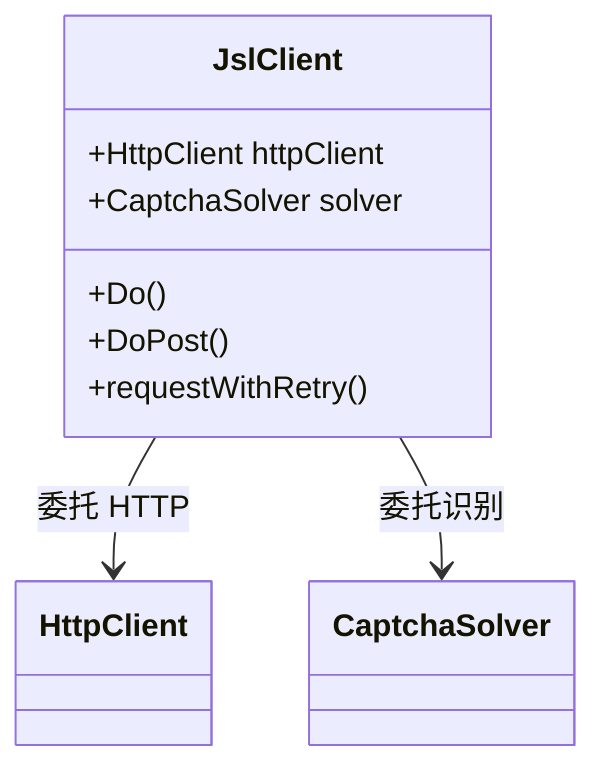

# JslClient

本页说明 go-jsl 包的核心类型 JslClient 的结构与依赖。

## 类型关系

JslClient 组合 HttpClient 与 CaptchaSolver，对外暴露加速乐解密后的请求入口。

```mermaid
classDiagram
    class JslClient {
        +HttpClient httpClient
        +CaptchaSolver solver
        +Do()
        +DoPost()
        +requestWithRetry()
    }
    class HttpClient
    class CaptchaSolver
    JslClient --> HttpClient : 委托 HTTP
    JslClient --> CaptchaSolver : 委托识别
```

> 本页内容将在后续任务填充。
