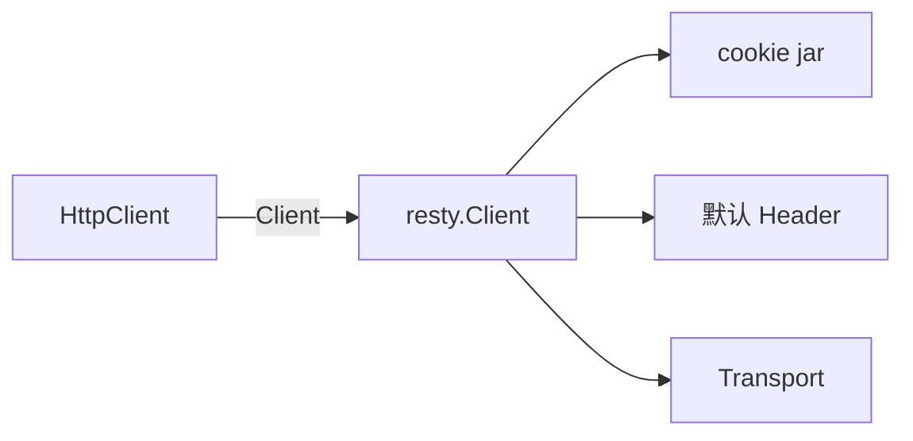

# Client 方法

`Client` 返回底层 resty client。源码：[`gojsl/httpclient.go`](https://github.com/scagogogo/cnvd-skills/blob/main/gojsl/httpclient.go)。

## 签名

```go
func (h *HttpClient) Client() *resty.Client
```

## 返回

`*resty.Client`：内部长生命周期的 resty 客户端实例，持有 cookie jar 与默认 Header。

## 用途

供需要直接操作 resty client 的场景，例如：
- 写入解密中间 cookie（实际由 `SetCookie` 完成）。
- 自定义重试策略、传输层配置。
- 读取 `resp.RawResponse` 等高级字段。



## 注意

直接操作返回的 client 会影响 `HttpClient` 的后续所有请求（共享实例）。并发场景需调用方自行加锁或每实例独立。

## 示例

```go
package main

import (
    "fmt"

    "github.com/scagogogo/go-jsl"
)

func main() {
    hc := jsl.NewHttpClient("", 30)
    c := hc.Client()
    fmt.Println("jar != nil:", c.GetClient().Jar != nil)
}
```

## 相关

- [HttpClient 结构](/api-gojsl/types/http-client-struct)
- [SetCookie](/api-gojsl/methods/set-cookie)
- [Cookies](/api-gojsl/methods/cookies)
