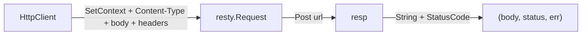
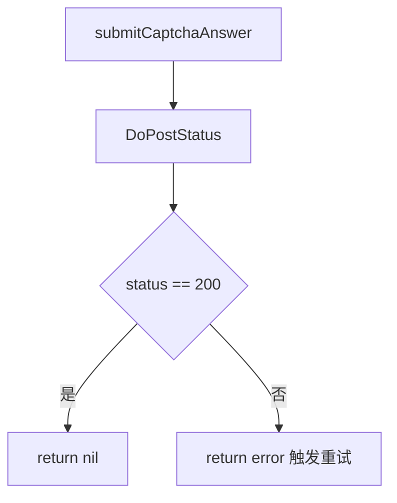

# DoPostStatus 方法

`DoPostStatus` 发起一次 POST，返回响应体与 HTTP 状态码。源码：[`gojsl/httpclient.go`](https://github.com/scagogogo/cnvd-skills/blob/main/gojsl/httpclient.go)。

## 签名

```go
func (h *HttpClient) DoPostStatus(ctx context.Context, targetURL, body string, extraHeaders map[string]string) (string, int, error)
```

## 参数与返回

| 参数 | 类型 | 语义 |
|------|------|------|
| `ctx` | `context.Context` | 请求上下文 |
| `targetURL` | `string` | 目标 URL |
| `body` | `string` | 请求体（form-urlencoded） |
| `extraHeaders` | `map[string]string` | 附加/覆盖 Header |

返回 `(string, int, error)`：响应体、HTTP 状态码、错误。

## 行为

与 `DoPost` 相同，但额外返回 `resp.StatusCode()`。



## 用途

`JslClient.captchaRequest` POST 提交验证码答案时用它：端点返回非 200（错误答案通常 401）视为失败，触发上层 `processCaptcha` 重试。详见 [processCaptcha 内部](/api-gojsl/methods/process-captcha-internals)。



## 示例

```go
package main

import (
    "context"
    "fmt"
    "net/url"

    "github.com/scagogogo/go-jsl"
)

func main() {
    hc := jsl.NewHttpClient("", 30)
    body := "ans=" + url.QueryEscape("答案") + "&sec=" + url.QueryEscape("token")
    resp, status, err := hc.DoPostStatus(context.Background(), "https://www.cnvd.org.cn/cdn-cgi/captcha/v2/captcha/image", body, map[string]string{
        "X-Requested-With": "XMLHttpRequest",
        "Referer":          "https://www.cnvd.org.cn/",
    })
    if err != nil {
        fmt.Println("err:", err)
        return
    }
    fmt.Println("status:", status, "resp:", resp)
}
```

## 相关

- [DoPost 方法](/api-gojsl/methods/do-post)
- [DoStatus 方法](/api-gojsl/methods/do-status)
- [processCaptcha 内部](/api-gojsl/methods/process-captcha-internals)
