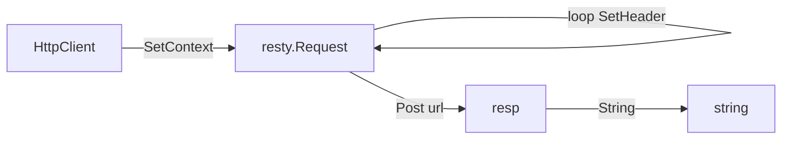

# DoPost 方法

`DoPost` 发起一次 POST（`application/x-www-form-urlencoded`），返回响应体字符串。源码：[`gojsl/httpclient.go`](https://github.com/scagogogo/cnvd-skills/blob/main/gojsl/httpclient.go)。

## 签名

```go
func (h *HttpClient) DoPost(ctx context.Context, targetURL, body string, extraHeaders map[string]string) (string, error)
```

## 参数与返回

| 参数 | 类型 | 语义 |
|------|------|------|
| `ctx` | `context.Context` | 请求上下文 |
| `targetURL` | `string` | 目标 URL |
| `body` | `string` | 请求体（form-urlencoded） |
| `extraHeaders` | `map[string]string` | 附加/覆盖 Header |

返回 `(string, error)`：响应体字符串。

## 行为

设 `Content-Type: application/x-www-form-urlencoded` 与 `body`，遍历 `extraHeaders`，`req.Post(targetURL)`，返回 `resp.String()`。



## 用途

供需要 POST 但不关心状态码的场景。验证码答案提交用 `DoPostStatus`（需按 200 判定）。

## 示例

```go
package main

import (
    "context"
    "log"
    "net/url"

    "github.com/scagogogo/go-jsl"
)

func main() {
    hc := jsl.NewHttpClient("", 30)
    body := "ans=" + url.QueryEscape("答案") + "&sec=" + url.QueryEscape("token")
    resp, err := hc.DoPost(context.Background(), "https://www.cnvd.org.cn/cdn-cgi/captcha/v2/captcha/image", body, map[string]string{
        "X-Requested-With": "XMLHttpRequest",
    })
    if err != nil {
        log.Fatal(err)
    }
    log.Printf("resp: %s", resp)
}
```

## 相关

- [DoPostStatus 方法](/api-gojsl/methods/do-post-status)
- [Do 方法](/api-gojsl/methods/do)
- [Header 策略](/api-gojsl/types/headers-strategy)
