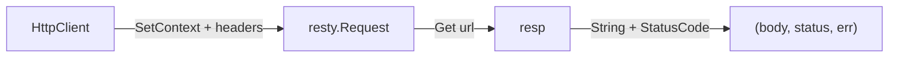

# DoStatus 方法

`DoStatus` 发起一次 GET，返回响应体与 HTTP 状态码。源码：[`gojsl/httpclient.go`](https://github.com/scagogogo/cnvd-skills/blob/main/gojsl/httpclient.go)。

## 签名

```go
func (h *HttpClient) DoStatus(ctx context.Context, targetURL string, extraHeaders map[string]string) (string, int, error)
```

## 参数与返回

| 参数 | 类型 | 语义 |
|------|------|------|
| `ctx` | `context.Context` | 请求上下文 |
| `targetURL` | `string` | 目标 URL |
| `extraHeaders` | `map[string]string` | 附加/覆盖 Header |

返回 `(string, int, error)`：响应体、HTTP 状态码、错误。

## 行为

与 `Do` 相同，但额外返回 `resp.StatusCode()`。



## 用途

供需按状态码判定的场景。`JslClient.captchaRequest` 取验证码图时用它：端点返回非 200 视为失败（触发上层重试）。详见 [processCaptcha 内部](/api-gojsl/methods/process-captcha-internals)。

## 示例

```go
package main

import (
    "context"
    "fmt"

    "github.com/scagogogo/go-jsl"
)

func main() {
    hc := jsl.NewHttpClient("", 30)
    body, status, err := hc.DoStatus(context.Background(), "https://www.cnvd.org.cn/cdn-cgi/captcha/v2/captcha/image?c=1&s=cnvdskills", map[string]string{
        "X-Requested-With": "XMLHttpRequest",
        "Referer":          "https://www.cnvd.org.cn/",
    })
    if err != nil {
        fmt.Println("err:", err)
        return
    }
    fmt.Println("status:", status, "body length:", len(body))
}
```

## 相关

- [Do 方法](/api-gojsl/methods/do)
- [DoPostStatus 方法](/api-gojsl/methods/do-post-status)
- [processCaptcha 内部](/api-gojsl/methods/process-captcha-internals)
