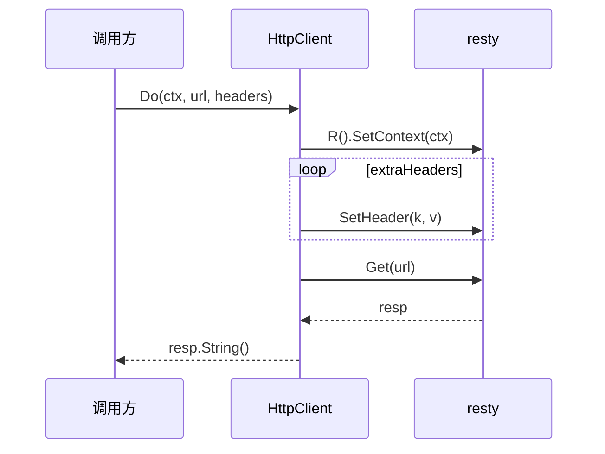

# Do 方法

`Do` 发起一次 GET，返回响应体字符串。源码：[`gojsl/httpclient.go`](https://github.com/scagogogo/cnvd-skills/blob/main/gojsl/httpclient.go)。

## 签名

```go
func (h *HttpClient) Do(ctx context.Context, targetURL string, extraHeaders map[string]string) (string, error)
```

## 参数与返回

| 参数 | 类型 | 语义 |
|------|------|------|
| `ctx` | `context.Context` | 请求上下文 |
| `targetURL` | `string` | 目标 URL |
| `extraHeaders` | `map[string]string` | 附加/覆盖 Header（如 captcha 加 X-Requested-With） |

返回 `(string, error)`：响应体字符串。

## 行为

`req := h.client.R().SetContext(ctx)`，遍历 `extraHeaders` 调 `req.SetHeader(k, v)`（覆盖默认头），`req.Get(targetURL)`，返回 `resp.String()`。



## 用途

`JslClient.plainRequest` 用它发导航 GET（带 `navigationHeaders`）。

## 示例

```go
package main

import (
    "context"
    "log"

    "github.com/scagogogo/go-jsl"
)

func main() {
    hc := jsl.NewHttpClient("", 30)
    body, err := hc.Do(context.Background(), "https://www.cnvd.org.cn/", map[string]string{
        "Referer": "https://www.cnvd.org.cn/",
    })
    if err != nil {
        log.Fatal(err)
    }
    log.Printf("body length: %d", len(body))
}
```

## 相关

- [DoStatus 方法](/api-gojsl/methods/do-status)
- [DoPost 方法](/api-gojsl/methods/do-post)
- [Header 策略](/api-gojsl/types/headers-strategy)
