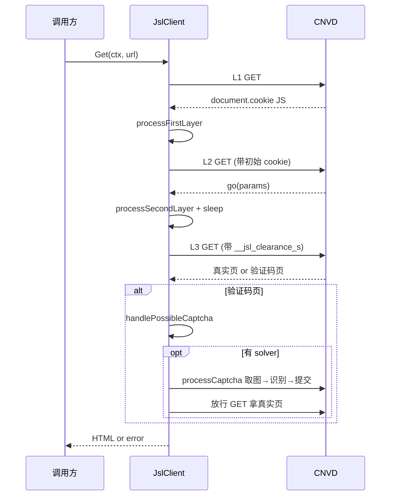

# Get 方法

`Get` 对被加速乐保护的目标 URL 发起 GET，自动完成三层解密与验证码挑战，返回最终页面 HTML。源码：[`gojsl/client.go`](https://github.com/scagogogo/cnvd-skills/blob/main/gojsl/client.go)。

## 签名

```go
func (x *JslClient) Get(ctx context.Context, targetUrl string) (string, error)
```

## 参数与返回

| 参数 | 类型 | 语义 |
|------|------|------|
| `ctx` | `context.Context` | 用于取消；三层每跳与验证码重试均感知 |
| `targetUrl` | `string` | 目标 URL |

返回 `(string, error)`：最终页面 HTML；error 可能是 `ErrCaptchaRequired` / `ErrCaptchaSolveFailed` / 创宇盾拦截 / 网络错误等。

## 全流程



## 每层判定与回退

- 第一层：`isFirstLayer` 不成立时直接走 `handlePossibleCaptcha`（可能已是真实页或验证码页）。
- 第二层：`isSecondLayer` 不成立时同样走 `handlePossibleCaptcha`。
- 第三层：响应交 `handlePossibleCaptcha` 处理。

详见 [三层解密深度解析](/api-gojsl/three-layers-deep-dive)。

## 示例

```go
package main

import (
    "context"
    "log"

    "github.com/scagogogo/go-jsl"
)

func main() {
    client := jsl.NewJslClient("", 60, jsl.CommandCaptchaSolver{
        Command: "python3",
        Args:    []string{"scripts/ddddocr_solver.py"},
    })
    html, err := client.Get(context.Background(), "https://www.cnvd.org.cn/flaw/show/CNVD-2021-67823")
    if err != nil {
        log.Fatal(err)
    }
    log.Printf("html length: %d", len(html))
}
```

## 错误处理

详见 [示例 - 错误处理](/api-gojsl/examples/error-handling) 与 [错误变量](/api-gojsl/errors)。

## 相关

- [processCaptcha 内部](/api-gojsl/methods/process-captcha-internals)
- [三层解密深度解析](/api-gojsl/three-layers-deep-dive)
- [基础 GET 示例](/api-gojsl/examples/basic-get)
