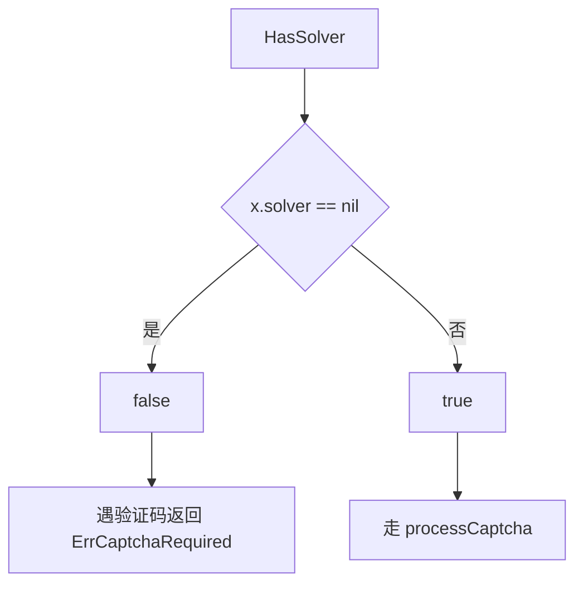

# HasSolver 方法

`HasSolver` 返回是否配置了验证码识别器。源码：[`gojsl/client.go`](https://github.com/scagogogo/cnvd-skills/blob/main/gojsl/client.go)。

## 签名

```go
func (x *JslClient) HasSolver() bool
```

## 返回

`bool`：`x.solver != nil`。

## 用途

运行期判断：若返回 false，遇验证码挑战会返回 `ErrCaptchaRequired`，应提前提示用户配置识别器。



## 示例

```go
package main

import (
    "fmt"

    "github.com/scagogogo/go-jsl"
)

func main() {
    c1 := jsl.NewJslClient("", 30, nil)
    fmt.Println("c1 has solver:", c1.HasSolver()) // false

    c2 := jsl.NewJslClient("", 30, jsl.NoopCaptchaSolver{})
    fmt.Println("c2 has solver:", c2.HasSolver()) // true
}
```

> 注：`NoopCaptchaSolver` 非空指针，`HasSolver` 返回 true，但其 `Solve` 永远返回 `ErrCaptchaRequired`。如需真正识别，用 `CommandCaptchaSolver` 或 `InteractiveCaptchaSolver`。

## 相关

- [NewJslClient](/api-gojsl/methods/new-jsl-client)
- [NoopCaptchaSolver](/api-gojsl/types/noop-captcha-solver)
- [ErrCaptchaRequired 详解](/api-gojsl/types/err-captcha-required)
