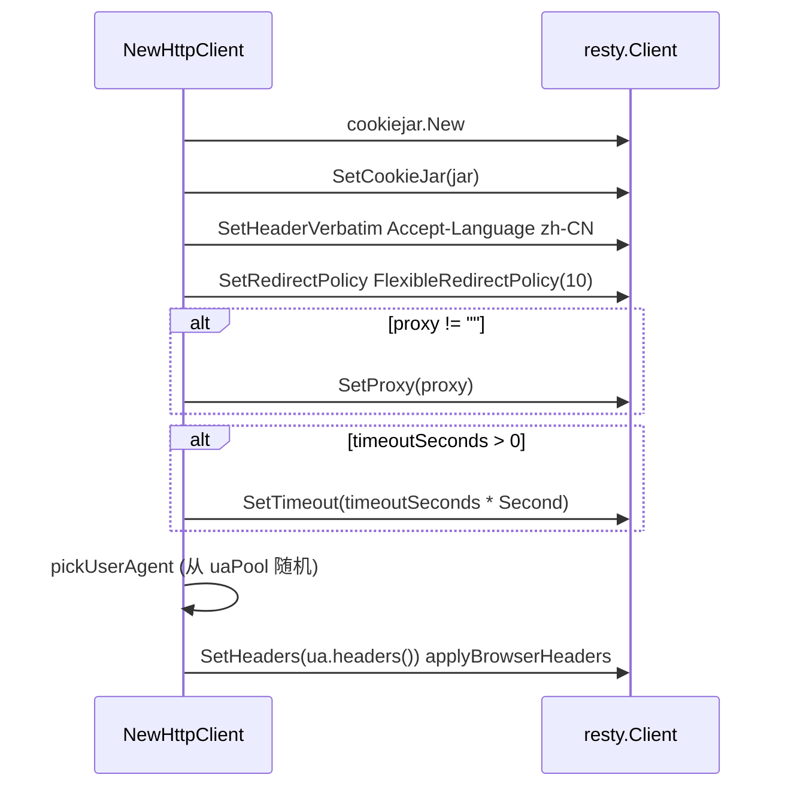

# NewHttpClient

`NewHttpClient` 构造一个统一 HTTP 客户端。源码：[`gojsl/httpclient.go`](https://github.com/scagogogo/cnvd-skills/blob/main/gojsl/httpclient.go)。

## 签名

```go
func NewHttpClient(proxy string, timeoutSeconds int) *HttpClient
```

## 参数

| 参数 | 类型 | 语义 |
|------|------|------|
| `proxy` | `string` | 代理地址；空串直连 |
| `timeoutSeconds` | `int` | 超时秒数；0 不限时 |

## 返回

`*HttpClient`，内部已启用 cookie jar、设置浏览器级默认 Header、随机选 UA。

## 构造步骤



## 示例

```go
package main

import (
    "context"
    "log"

    "github.com/scagogogo/go-jsl"
)

func main() {
    hc := jsl.NewHttpClient("", 30)
    body, err := hc.Do(context.Background(), "https://www.cnvd.org.cn/", nil)
    if err != nil {
        log.Fatal(err)
    }
    log.Printf("body length: %d", len(body))
}
```

## 独立使用

`HttpClient` 可脱离 `JslClient` 独立使用，享受连接复用、cookie jar、浏览器级 Header。详见 [HttpClient 类型](/api-gojsl/http-client)。

## 相关

- [HttpClient 结构](/api-gojsl/types/http-client-struct)
- [Do 方法](/api-gojsl/methods/do)
- [UA 池内部](/api-gojsl/types/ua-pool-internals)
