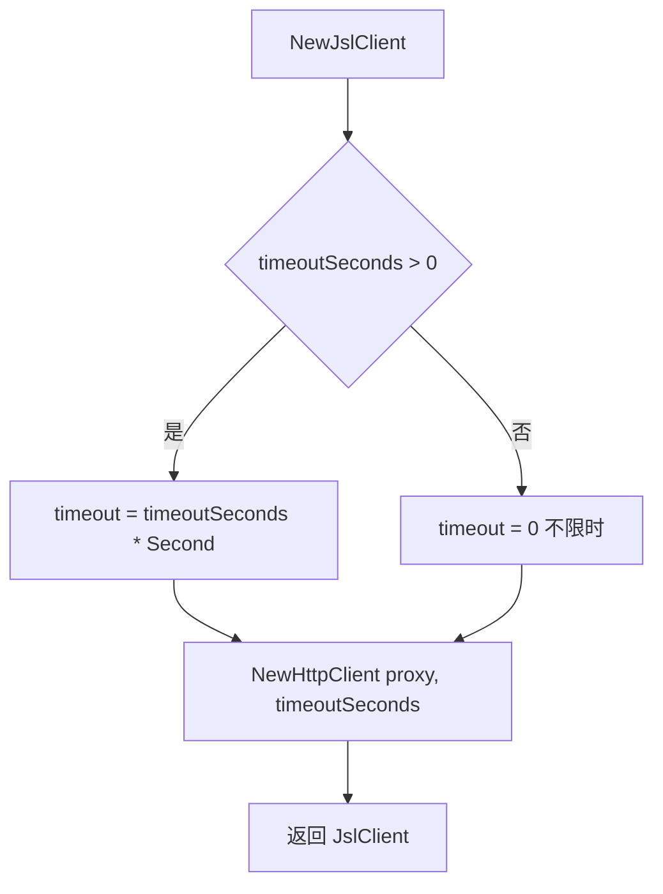

# NewJslClient

`NewJslClient` 构造一个加速乐客户端。源码：[`gojsl/client.go`](https://github.com/scagogogo/cnvd-skills/blob/main/gojsl/client.go)。

## 签名

```go
func NewJslClient(proxy string, timeoutSeconds int, solver CaptchaSolver) *JslClient
```

## 参数

| 参数 | 类型 | 语义 |
|------|------|------|
| `proxy` | `string` | 代理地址；空串表示直连 |
| `timeoutSeconds` | `int` | 超时秒数；0 表示不限时 |
| `solver` | `CaptchaSolver` | 验证码识别器；nil 时遇验证码返回 `ErrCaptchaRequired` |

## 返回

`*JslClient`，内部已构造 `HttpClient`（启用 cookie jar + 浏览器级 Header）。

## 行为



内部：`timeout` 仅记录在 `JslClient.timeout`，实际超时由 `HttpClient` 落地（`resty.SetTimeout`）。

## 示例

```go
package main

import (
    "github.com/scagogogo/go-jsl"
)

func main() {
    // 直连 + 30 秒超时 + 不识别验证码
    c1 := jsl.NewJslClient("", 30, nil)

    // 代理 + 60 秒 + ddddocr 全自动
    c2 := jsl.NewJslClient("http://127.0.0.1:7890", 60, jsl.CommandCaptchaSolver{
        Command: "python3",
        Args:    []string{"scripts/ddddocr_solver.py"},
    })

    _, _, _ = c1, c2, c2.Proxy()
}
```

## 相关

- [JslClient 类型](/api-gojsl/jsl-client)
- [Get 方法](/api-gojsl/methods/get)
- [代理与超时示例](/api-gojsl/examples/proxy-timeout)
