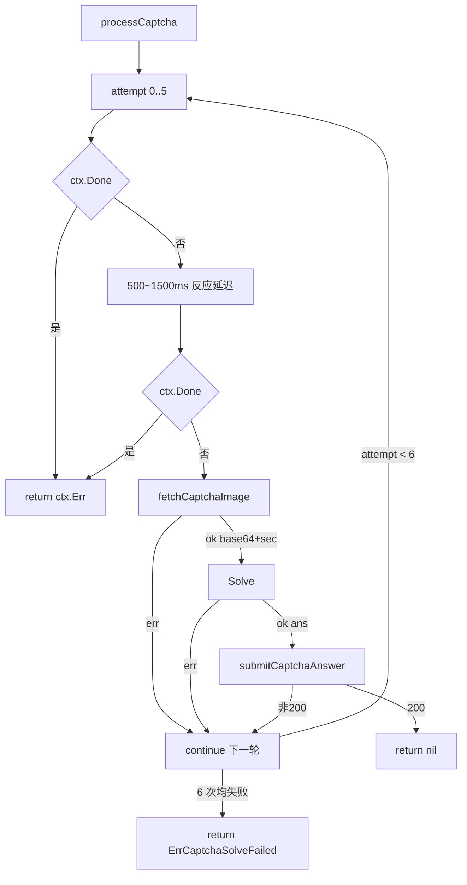

# processCaptcha 内部流程

`processCaptcha` 完整执行验证码挑战：取图→识别→提交，最多重试 6 次。未导出但文档说明内部细节。源码：[`gojsl/client.go`](https://github.com/scagogogo/cnvd-skills/blob/main/gojsl/client.go)。

## 签名

```go
func (x *JslClient) processCaptcha(ctx context.Context, targetUrl string) error
```

## maxAttempts

```go
const maxAttempts = 6
```

重试是因为验证码图为中文词组、ddddocr 识别有概率性，多次重试可显著提升通过率。

## 流程



## 人类反应延迟

每轮取图前 `time.Duration(500+globalRand.Intn(1000)) * time.Millisecond`（500~1500ms 随机），模拟人类看图反应，降低机器化特征。延迟与 `ctx` 取消并发 select。

## 子步骤

- `fetchCaptchaImage`：GET `https://www.cnvd.org.cn/cdn-cgi/captcha/v2/captcha/image?c=1&s=cnvdskills`，解析 JSON `{image, sec, msg}`，返回 base64 图与 sec token。
- `solver.Solve(ctx, imageBase64)`：调用识别器。
- `submitCaptchaAnswer`：POST `ans=<urlencoded>&sec=<urlencoded>` 到同端点，成功（200）返回 nil；错误答案通常返回 401。

## 取图/提交端点

固定为 `https://www.cnvd.org.cn/cdn-cgi/captcha/v2/captcha/image`（GET 取图带 `?c=1&s=cnvdskills`，POST 提交不带 query）。cookie 由 HttpClient 的 jar 自动携带。

## 错误出口

| 情况 | 返回 |
|------|------|
| `ctx` 取消 | `ctx.Err()` |
| 6 次均失败 | `ErrCaptchaSolveFailed` |
| 某轮提交 200 | `nil`（成功） |

`fetchCaptchaImage` / `Solve` / `submitCaptchaAnswer` 单次失败仅 `continue`，不立即返回错误（除 ctx 取消）。

## 相关

- [Solve 接口方法](/api-gojsl/methods/solve)
- [ErrCaptchaSolveFailed 详解](/api-gojsl/types/err-captcha-solve-failed)
- [架构 - 验证码挑战](/architecture/captcha)
- [三层解密深度解析](/api-gojsl/three-layers-deep-dive)
