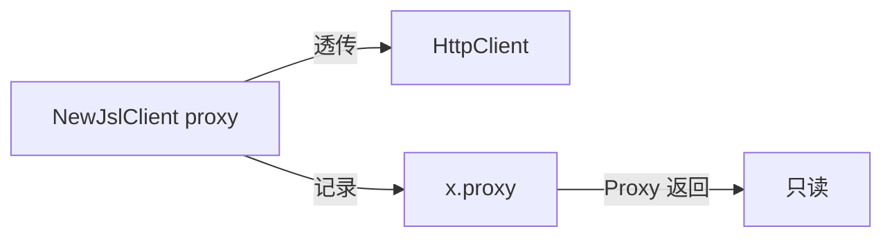

# Proxy 方法

`Proxy` 返回当前客户端配置的代理地址（只读）。源码：[`gojsl/client.go`](https://github.com/scagogogo/cnvd-skills/blob/main/gojsl/client.go)。

## 签名

```go
func (x *JslClient) Proxy() string
```

## 返回

`string`：构造时传入的 `proxy` 值；空串表示直连。

## 用途

调试与日志：确认客户端实际使用的代理配置。注意此方法仅返回 `JslClient.proxy` 字段，不反映 `HttpClient` 内部 resty client 的代理状态（构造时已透传，运行期不再变更）。



## 示例

```go
package main

import (
    "fmt"

    "github.com/scagogogo/go-jsl"
)

func main() {
    c1 := jsl.NewJslClient("", 30, nil)
    fmt.Println("c1 proxy:", c1.Proxy()) // ""

    c2 := jsl.NewJslClient("http://127.0.0.1:7890", 30, nil)
    fmt.Println("c2 proxy:", c2.Proxy()) // "http://127.0.0.1:7890"
}
```

## 相关

- [NewJslClient](/api-gojsl/methods/new-jsl-client)
- [代理与超时示例](/api-gojsl/examples/proxy-timeout)
- [FAQ - 代理被封](/faq/proxy-banned)
