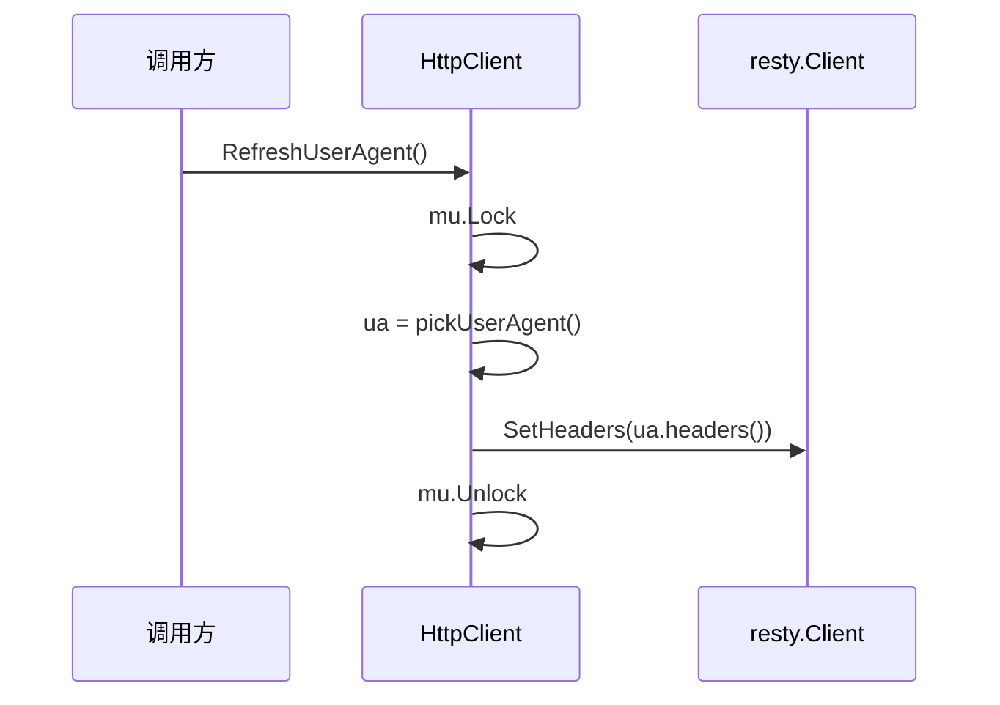

# RefreshUserAgent 方法

`RefreshUserAgent` 轮换到另一个 UA，供长会话定期换装，降低指纹固定风险。源码：[`gojsl/httpclient.go`](https://github.com/scagogogo/cnvd-skills/blob/main/gojsl/httpclient.go)。

## 签名

```go
func (h *HttpClient) RefreshUserAgent()
```

## 行为

加锁（`h.mu`），重新 `pickUserAgent`（从 `uaPool` 随机选），调 `applyBrowserHeaders` 把新 UA 对应的浏览器级 Header 全套重设到 client 默认头。



## 用途

长会话（如翻页抓取上百页）定期轮换 UA，避免单一固定 UA 的指纹特征。注意轮换是随机的，可能选到与当前相同的 UA（4 选 1，概率 1/4）。

## 并发安全

`mu` 保护 `ua` 与 `applyBrowserHeaders` 的原子性。但 resty `SetHeaders` 对其他正在飞的请求的影响由 resty 内部处理，建议在请求间隙调用。

## 示例

```go
package main

import (
    "context"
    "log"
    "time"

    "github.com/scagogogo/go-jsl"
)

func main() {
    hc := jsl.NewHttpClient("", 30)
    for i := 0; i < 5; i++ {
        if i > 0 {
            hc.RefreshUserAgent()
        }
        body, err := hc.Do(context.Background(), "https://www.cnvd.org.cn/", nil)
        if err != nil {
            log.Fatal(err)
        }
        log.Printf("round %d body length: %d", i, len(body))
        time.Sleep(2 * time.Second)
    }
}
```

详见 [示例 - UA 轮换](/api-gojsl/examples/ua-rotation)。

## 相关

- [UA 池内部](/api-gojsl/types/ua-pool-internals)
- [userAgent 内部](/api-gojsl/types/user-agent-internals)
- [UA 轮换示例](/api-gojsl/examples/ua-rotation)
