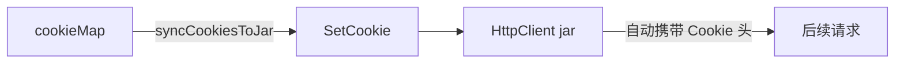

# SetCookie 方法

`SetCookie` 往 cookie jar 写入一个 cookie。源码：[`gojsl/httpclient.go`](https://github.com/scagogogo/cnvd-skills/blob/main/gojsl/httpclient.go)。

## 签名

```go
func (h *HttpClient) SetCookie(targetURL, name, value string)
```

## 参数

| 参数 | 类型 | 语义 |
|------|------|------|
| `targetURL` | `string` | 用于解析 Domain 与 Path 作用域 |
| `name` | `string` | cookie 名 |
| `value` | `string` | cookie 值 |

内部 `url.Parse(targetURL)` 失败时静默返回；成功则调用：

```go
h.client.GetClient().Jar.SetCookies(u, []*http.Cookie{
    {Name: name, Value: value, Path: "/", Domain: u.Hostname()},
})
```

## 用途

`JslClient.syncCookiesToJar` 用它把第一层 goja 算出、第二层 `newCookie` 算出的解密 cookie 同步进 jar，使后续请求的 `Cookie` 头由 jar 统一携带。



## 示例

```go
package main

import (
    "fmt"

    "github.com/scagogogo/go-jsl"
)

func main() {
    hc := jsl.NewHttpClient("", 30)
    hc.SetCookie("https://www.cnvd.org.cn/", "__jsl_clearance_s", "value123")
    for _, c := range hc.Cookies("https://www.cnvd.org.cn/") {
        fmt.Printf("%s=%s\n", c.Name, c.Value)
    }
}
```

## 相关

- [Cookies 方法](/api-gojsl/methods/cookies)
- [JslClient 结构](/api-gojsl/types/jsl-client-struct)
- [架构 - cookie 生命周期](/architecture/cookie-lifecycle)
