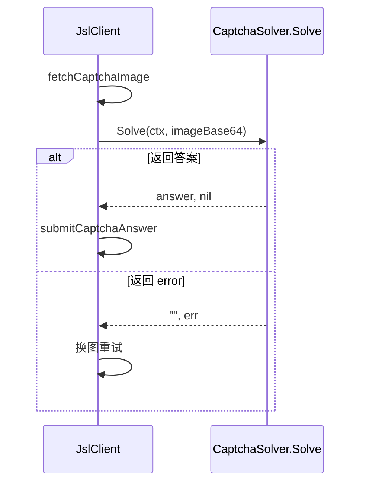

# Solve 接口方法

`Solve` 是 `CaptchaSolver` 接口的唯一方法，把验证码图片翻译成答案字符串。源码：[`gojsl/captcha.go`](https://github.com/scagogogo/cnvd-skills/blob/main/gojsl/captcha.go)。

## 签名

```go
Solve(ctx context.Context, imageBase64 string) (string, error)
```

## 参数与返回

| 参数 | 类型 | 语义 |
|------|------|------|
| `ctx` | `context.Context` | 用于取消 |
| `imageBase64` | `string` | base64 编码的 PNG 图片（与 CNVD captcha 端点 `image` 字段同格式） |

返回 `(string, error)`：识别出的答案；error 表示无法识别，库会换图重试。

## 调用方

`JslClient.processCaptcha` 在每轮重试中调用：



## 实现者契约

- 返回 error 时库会换图重试，最多 6 次（见 [processCaptcha 内部](/api-gojsl/methods/process-captcha-internals)）。
- `ctx` 应被尊重，长任务（如等待人工）需 `select <-ctx.Done()`。
- 答案字符串应去除首尾空白（库不 trim，由实现负责）。

## 内置实现

| 实现 | Solve 行为 | 详见 |
|------|-----------|------|
| `NoopCaptchaSolver` | 永远返回 `("", ErrCaptchaRequired)` | [Noop](/api-gojsl/types/noop-captcha-solver) |
| `StaticCaptchaSolver` | 返回固定 Answer 与 Err | [Static](/api-gojsl/types/static-captcha-solver) |
| `InteractiveCaptchaSolver` | 写图 + 轮询环境变量 | [Interactive](/api-gojsl/types/interactive-captcha-solver) |
| `CommandCaptchaSolver` | 起子进程 stdin/stdout | [Command](/api-gojsl/types/command-captcha-solver) |

## 示例（自定义）

```go
type MySolver struct{}
func (MySolver) Solve(ctx context.Context, imageBase64 string) (string, error) {
    return callMyOCR(ctx, imageBase64)
}
```

详见 [示例 - 自定义 Solver](/api-gojsl/examples/custom-solver)。

## 相关

- [CaptchaSolver 接口](/api-gojsl/types/captcha-solver-interface)
- [processCaptcha 内部](/api-gojsl/methods/process-captcha-internals)
- [CaptchaSolver 概览](/api-gojsl/captcha-solver)
