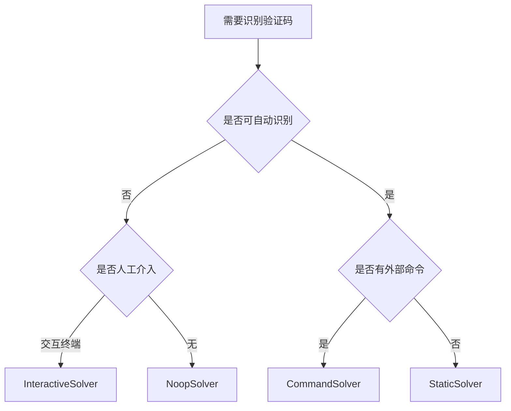

# Solver 实现详解

本页对比四种 CaptchaSolver 实现：Noop、Static、Interactive、Command。

## 选择决策树

按运行环境与是否需要人工介入选择合适的 Solver。

```mermaid
flowchart TD
    A[需要识别验证码] --> B{是否可自动识别}
    B -- 否 --> C{是否人工介入}
    B -- 是 --> D{是否有外部命令}
    C -- 交互终端 --> E[InteractiveSolver]
    C -- 无 --> F[NoopSolver]
    D -- 是 --> G[CommandSolver]
    D -- 否 --> H[StaticSolver]
```

> 本页内容将在后续任务填充。
