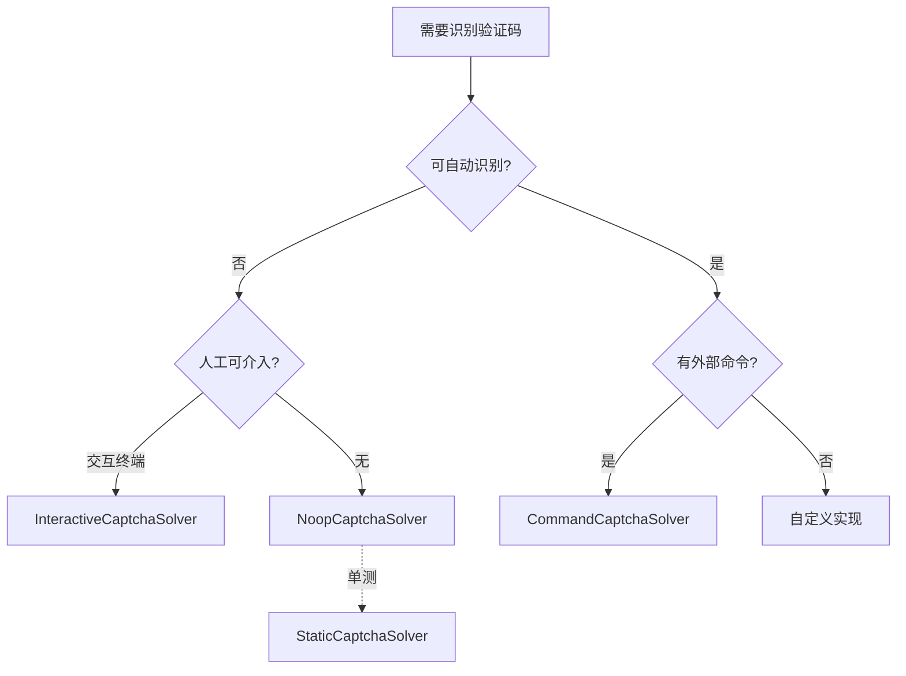
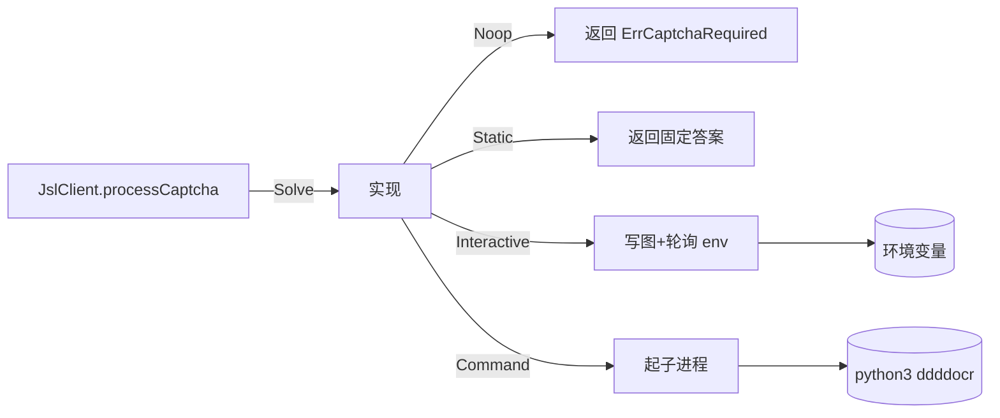

# Solver 实现详解

go-jsl 内置四种 `CaptchaSolver` 实现，覆盖从单测到全自动生产的各类场景。

## 对比表

| 实现 | 识别来源 | 是否人工 | 典型场景 | 是否需外部依赖 |
|------|----------|----------|----------|----------------|
| `NoopCaptchaSolver` | 永不识别 | 否 | 明确要求调用方配识别器 | 无 |
| `StaticCaptchaSolver` | 固定值 | 否 | 单测 | 无 |
| `InteractiveCaptchaSolver` | 人工/外部脚本填环境变量 | 是 | 交互调试 | 无 |
| `CommandCaptchaSolver` | 外部命令 stdin/stdout | 否 | 生产（配合 ddddocr） | Python + ddddocr |

## 选择决策树



## 各实现要点

### NoopCaptchaSolver

```go
type NoopCaptchaSolver struct{}
func (NoopCaptchaSolver) Solve(ctx context.Context, imageBase64 string) (string, error)
```

`Solve` 永远返回 `("", ErrCaptchaRequired)`。等价于 `NewJslClient(..., nil)`，但语义更明确。详见 [Noop 详解](/api-gojsl/types/noop-captcha-solver)。

### InteractiveCaptchaSolver

```go
type InteractiveCaptchaSolver struct {
    AnswerEnv    string        // 默认 CNVD_CAPTCHA_ANSWER
    ImageDir     string        // 默认 os.TempDir()
    WaitTimeout  time.Duration // 默认 5 分钟
    PollInterval time.Duration // 默认 1 秒
}
```

写图到磁盘临时文件后轮询环境变量，读到答案后清空并返回。超时返回 wrap 了 `ErrCaptchaSolveFailed` 的错误。详见 [Interactive 详解](/api-gojsl/types/interactive-captcha-solver)。

### StaticCaptchaSolver

```go
type StaticCaptchaSolver struct {
    Answer string
    Err    error
}
```

`Solve` 直接返回 `Answer` 与 `Err`。仅供单测。详见 [Static 详解](/api-gojsl/types/static-captcha-solver)。

### CommandCaptchaSolver

```go
type CommandCaptchaSolver struct {
    Command string   // 如 "python3"
    Args    []string // 如 ["scripts/ddddocr_solver.py"]
}
```

起子进程，stdin 写 base64 图片，stdout 读答案。命令退出码非 0 视为识别失败。详见 [Command 详解](/api-gojsl/types/command-captcha-solver)。

## 调用方与实现的关系



## 示例对照

| 场景 | 推荐 | 示例链接 |
|------|------|----------|
| 全自动生产 | `CommandCaptchaSolver` | [验证码全自动](/api-gojsl/examples/captcha-auto) |
| 交互调试 | `InteractiveCaptchaSolver` | [验证码交互](/api-gojsl/examples/captcha-interactive) |
| 自定义后端 | 自定义实现 | [自定义 Solver](/api-gojsl/examples/custom-solver) |
| 单测 | `StaticCaptchaSolver` | [Static 详解](/api-gojsl/types/static-captcha-solver) |
